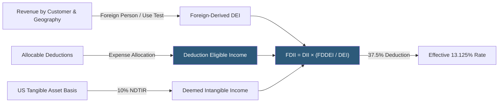

**Category:** Business Intelligence & Tax Analytics
**Difficulty:** Advanced
**Reading time:** 6 min read

---

Foreign-Derived Intangible Income (FDII) is a US tax provision providing a deduction for US corporations earning income from sales of property to foreign persons and from services to foreign persons or for use outside the US. The deduction effectively taxes qualifying export income at a reduced 13.125% rate (rising to 16.406% after 2025), incentivizing US-based intellectual property ownership.

- **FDII deduction** — Section 250 deduction equal to 37.5% of qualifying FDII (reduced after 2025)
- **Deduction eligible income (DEI)** — Gross income from sales and services to foreign customers, net of allocable deductions
- **Foreign-derived deduction eligible income (FDDEI)** — The portion of DEI from sales to foreign persons for use outside the US
- **Deemed intangible income (DII)** — DEI minus 10% of qualified business asset investment (QBAI) — the routine return exclusion
- **FDII fraction** — FDDEI / DEI, applied to DII to compute the FDII amount
- **Qualified sales** — Sales of property to foreign persons for foreign use, excluding related-party transactions that don't meet certain standards
- **Qualified services** — Services provided to foreign persons or with respect to property located outside the US
- **250 deduction limitation** — Section 250 deduction is limited by the excess of taxable income over GILTI inclusion

FDII analytics begin with classifying revenue transactions as qualifying or non-qualifying. Foreign property sales require the buyer to be a foreign person and the property to be used outside the US. For tangible goods, the destination test (shipped outside the US) generally establishes foreign use. For digital goods and software, additional analysis is required to demonstrate that the end user is outside the US.

Service revenue is eligible if provided to foreign persons or with respect to property located outside the US. Professional services billed to foreign clients, cloud services delivered to foreign users, and R&D services performed for foreign entities can all qualify. Analytics classify each service revenue transaction against customer location and service delivery geography.

The FDII calculation applies to the company's US operations (not CFCs). DEI is computed as qualifying gross income minus allocable expenses using the same expense allocation principles as the foreign tax credit regulations. QBAI represents the average tax basis of US tangible depreciable property, and the 10% routine return (NDTIR) reduces DII by the excluded return on physical assets.

The FDII fraction (FDDEI / DEI) represents the proportion of the intangible return attributable to foreign markets. This fraction is applied to DII to derive the FDII amount, on which the 37.5% deduction is then applied (subject to the taxable income limitation coordinated with GILTI).

Analytics integrate FDII calculation with GILTI to optimize the Section 250 deduction allocation between the two items when the combined deduction is limited by taxable income.

- Computing FDII deduction for a US software company with significant international cloud revenue
- Classifying foreign research service revenue as qualifying FDDEI for analytics-based return preparation
- Modeling the FDII impact of moving IP development activity from Ireland back to the US
- Analyzing the interaction between FDII deduction and GILTI inclusion when the Section 250 deduction is limited
- Projecting FDII benefit under post-2025 rate reduction scenarios affecting the effective rate

| Advantage | Disadvantage |
|-----------|--------------|
| FDII provides a statutory rate benefit for US-sourced international IP income | Complex customer and geographic classification requirements for qualifying revenue |
| Analytics can identify qualifying services revenue that is commonly missed | Expense allocation rules reduce DEI, requiring detailed allocation methodology |
| FDII creates an incentive for IP ownership in the US vs offshore structures | Post-2025 rate reduction diminishes FDII benefit, affecting planning value |
| Section 250 coordination with GILTI requires integrated modeling of both provisions | Foreign customer documentation requirements for tangible goods sales are burdensome |

- [GILTI (Global Intangible Low-Taxed Income)](gilti-global-intangible-low-taxed-income.md)
- [Subpart F Income Calculation](subpart-f-income-calculation.md)
- [Tax Scenario Planning](tax-scenario-planning.md)

---
*Part of the [Business Intelligence & Tax Analytics](index.md) category · [Back to Master Index](../../index.md)*
