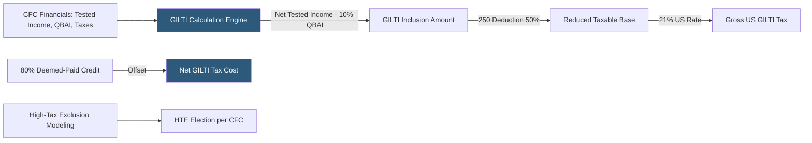

**Category:** Business Intelligence & Tax Analytics
**Difficulty:** Advanced
**Reading time:** 7 min read

---

GILTI is a US international tax provision requiring US shareholders of controlled foreign corporations (CFCs) to include in income a portion of their CFCs' income exceeding a routine return on tangible assets. Analytics platforms calculate GILTI inclusions, track the associated deductions and credits, and model planning strategies to minimize the net GILTI tax cost.

- **Tested income/loss** — A CFC's gross income minus allocable deductions, excluding subpart F income, ECI, and certain other items
- **Net tested income** — The aggregate of each CFC's tested income, reduced by tested losses
- **Qualified Business Asset Investment (QBAI)** — The average adjusted basis of a CFC's tangible depreciable property, the return on which is excluded from GILTI
- **Net deemed tangible income return (NDTIR)** — 10% of QBAI; the excluded routine return in the GILTI formula
- **GILTI inclusion amount** — Net tested income minus NDTIR; the amount US shareholders include in taxable income
- **Section 250 deduction** — 50% deduction (37.5% for years after 2025) against GILTI inclusion before the 10.5% GILTI rate applies
- **Section 960 deemed-paid credit** — 80% of foreign income taxes attributable to GILTI can be claimed as a foreign tax credit
- **High-tax exclusion (HTE)** — Regulation allowing exclusion from tested income for CFC income taxed above 90% of the US statutory rate

GILTI calculation analytics aggregate CFC-level data across all controlled foreign corporations. For each CFC, tested income is calculated as total income minus allocable expenses, with specific exclusions applied (subpart F inclusions, ECI, Section 954(b)(4) high-tax exclusions). QBAI is calculated as the average of the beginning and ending adjusted tax basis of tangible depreciable property used in the CFC's trade or business.

The GILTI inclusion is the aggregate of all CFCs' tested income (losses from loss CFCs net against income from profit CFCs) minus 10% of aggregate QBAI. The US parent reports this inclusion on Form 8992 and includes it in taxable income.

The Section 250 deduction reduces the inclusion by 50% (21% × 50% = 10.5% effective GILTI rate), but only if the US parent has positive taxable income after taking the deduction. Analytics model the taxable income limitation, which can reduce the 250 deduction below 50% in loss years.

The Section 960 deemed-paid credit pools 80% of the foreign income taxes allocable to tested income from all profit CFCs (high-tax kickout rules apply). The credit is limited to the FTC limitation based on the ratio of GILTI net income to total taxable income. Excess credits can be carried forward one year and back 10 years.

High-tax exclusion analytics compute the effective foreign rate for each CFC and identify those above 18.9% (90% × 21%) where making the HTE election removes the CFC from tested income entirely, reducing the GILTI inclusion. The election is made annually and must be consistent across all CFCs.

- Computing annual GILTI inclusion amount across 80 CFCs in 30 countries
- Modeling the Section 250 deduction limitation in years with consolidated US losses
- Identifying CFCs where the high-tax exclusion election reduces GILTI cost
- Analyzing the FTC utilization rate for Section 960 credits against GILTI basket
- Projecting GILTI tax cost under proposed Pillar Two minimum tax interaction scenarios

| Advantage | Disadvantage |
|-----------|--------------|
| Automated calculation across all CFCs replaces manual Excel GILTI model | CFC-level QBAI data requires detailed tax basis records by property category |
| HTE election modeling identifies optimal elections before the annual deadline | HTE consistency requirement prevents selective CFC-by-CFC election optimization |
| FTC utilization analytics prevent excess credit waste in the GILTI basket | GILTI basket limitation interacts with general basket FTC, requiring integrated credit model |
| Pillar Two interaction modeling quantifies GloBE top-up vs GILTI relationship | Ongoing regulatory guidance for Pillar Two GILTI interaction creates frequent model updates |

- [FDII (Foreign-Derived Intangible Income)](fdii-foreign-derived-intangible-income.md)
- [Subpart F Income Calculation](subpart-f-income-calculation.md)
- [Tax Scenario Planning](tax-scenario-planning.md)

---
*Part of the [Business Intelligence & Tax Analytics](index.md) category · [Back to Master Index](../../index.md)*
