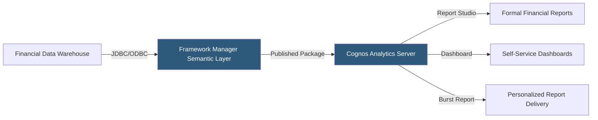

**Category:** Business Intelligence & Tax Analytics
**Difficulty:** Advanced
**Reading time:** 6 min read

---

IBM Cognos Analytics is an enterprise BI platform with decades of financial reporting heritage, known for its Framework Manager semantic layer, guided report authoring, and pixel-perfect financial statement output. It remains embedded in large financial institutions and enterprises with legacy Cognos deployments alongside newer cloud analytics initiatives.

- **Framework Manager** — Cognos's metadata modeling tool that creates a semantic layer abstracting physical database schemas
- **Package** — A published Framework Manager model deployed to Cognos for report authors to use
- **Report Studio** — Advanced authoring environment for creating complex financial reports with crosstabs, charts, and conditional formatting
- **Query Studio** — Self-service ad-hoc query interface for finance analysts
- **Dashboard (Cognos Analytics 11)** — Drag-and-drop dashboard authoring in the modern Cognos UI
- **Burst report** — A single report run once that generates output personalized per recipient based on filters
- **Cognos TM1 / Planning Analytics** — IBM's financial planning and forecasting module integrated with Cognos reporting
- **Drill-through** — Navigation from summary financial reports to detailed transaction reports

Cognos Analytics architecture centers on the Framework Manager semantic layer. Data modelers use Framework Manager to connect to financial data warehouses, define business objects (query subjects) mapping to tables or SQL views, create calculated measures (ETR, variance percentages), establish parent-child hierarchies for chart of accounts, and define row-level security rules. The completed model is published as a package to the Cognos server.

Report authors access packages in Report Studio to build financial reports without SQL. Crosstab reports (period across columns, accounts down rows) are the standard format for financial statements. Conditional formatting applies color coding to highlight variances exceeding thresholds. Prompt pages allow users to select entity, period, and currency before running reports.

Burst reporting is Cognos's most powerful distribution feature: a single report template is executed once, with each output filtered and delivered to a specific recipient based on a "burst key" (typically an entity or region code). A quarterly tax summary report bursts to 50 regional controllers, each receiving only their jurisdictions' data, without maintaining 50 separate reports.

IBM Planning Analytics (formerly TM1) integrates with Cognos reporting, providing multidimensional tax forecasting and scenario planning cubes accessible from Cognos dashboards alongside actual financial data from the data warehouse.

- Running weekly burst reports delivering entity-specific tax summaries to 100 controllers globally
- Building pixel-perfect financial statement reports meeting external reporting format requirements
- Connecting to TM1 tax forecast data alongside ERP actuals in a single consolidated report
- Providing regulated industries (banking, insurance) with auditable financial reporting infrastructure
- Maintaining legacy financial report libraries in organizations with existing Cognos investments

| Advantage | Disadvantage |
|-----------|--------------|
| Framework Manager provides rigorous enterprise semantic layer | Complex toolchain (Framework Manager + Report Studio) has steep learning curve |
| Burst reporting efficiently personalizes mass report distribution | Aging UI compared to modern BI tools; modern dashboard UX requires Cognos 11+ |
| Strong regulatory compliance audit trail for financial reporting | High total cost of ownership including licensing, infrastructure, and specialized skills |
| Proven in large-scale financial reporting deployments for decades | New features lag behind Tableau, Power BI, and Looker in frequency |

- [Oracle Analytics Cloud](oracle-analytics-cloud.md)
- [SAP Analytics Cloud](sap-analytics-cloud.md)
- [MicroStrategy Tax Analytics](microstrategy-tax-analytics.md)

---
*Part of the [Business Intelligence & Tax Analytics](index.md) category · [Back to Master Index](../../index.md)*
