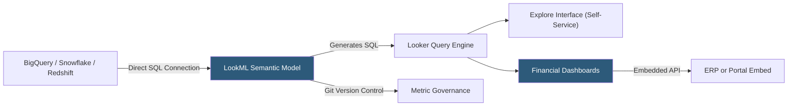

**Category:** Business Intelligence & Tax Analytics
**Difficulty:** Intermediate
**Reading time:** 6 min read

---

Looker, now part of Google Cloud, uses a semantic modeling layer called LookML to define financial metrics once and reuse them across all reports and dashboards. This governance-first approach makes Looker popular in enterprises where consistent KPI definitions, data lineage, and version-controlled metric definitions are critical for financial reporting integrity.

- **LookML** — Looker's YAML-based modeling language that defines dimensions, measures, and relationships
- **Explore** — An interactive query builder end users access to create custom financial analyses without SQL
- **View** — A LookML object mapping to a database table or derived SQL expression
- **Derived table** — A SQL subquery defined in LookML and materialized as a view, used for complex financial calculations
- **Model** — A LookML file grouping views into explorable topics with join relationships
- **Scheduled Look** — A saved query that delivers results by email or webhook on a schedule
- **Dashboard filter** — Cross-dashboard parameter that drives multiple tiles simultaneously
- **Looker Studio (Data Studio)** — Google's free visualization layer that connects to Looker semantic models

Looker does not import or store data — it generates SQL queries that execute against the organization's data warehouse (BigQuery, Snowflake, Redshift, etc.) and returns results in real time. This architecture means financial data always reflects the current state of the warehouse without extract synchronization delays.

LookML defines the financial data model as views (mapping to GL tables, budget tables, dimension tables) with dimensions (account code, entity, period) and measures (sum of amount, count of transactions, derived ratios). The model file specifies how views join together: `join: budget { type: left_outer; sql_on: ${actuals.period} = ${budget.period};; }`.

Financial KPIs are defined once as LookML measures and automatically appear in all explorations and dashboards referencing that view. When the definition of "Operating Income" changes (for example, adding a new cost category), the LookML change propagates to all reports immediately. LookML files are stored in Git, enabling version control, pull request review, and rollback of metric definition changes.

The Explore interface allows finance analysts to self-serve by selecting dimensions and measures, applying date filters, adding table calculations, and pivoting results — all without writing SQL. This democratizes financial analysis while ensuring metric consistency through the LookML layer.

- Defining a single authoritative "Net Revenue" measure used consistently across all revenue reports
- Building self-service financial explorations for FP&A without SQL expertise
- Embedding financial dashboards into ERP or internal portals via Looker's Embed API
- Version-controlling financial KPI definitions alongside data transformation code
- Connecting directly to BigQuery for real-time financial analytics on warehouse data

| Advantage | Disadvantage |
|-----------|--------------|
| Git-versioned LookML ensures governed, auditable metric definitions | Steep LookML learning curve requires developer or analyst investment |
| Direct-to-warehouse queries eliminate extract sync issues | Live queries can be slow on large financial tables without proper indexing |
| Single metric definition propagates across all reports | Enterprise pricing makes Looker expensive for small finance teams |
| Self-service Explore reduces ad-hoc SQL requests to data engineering | LookML complexity grows quickly for sophisticated financial models |

- [Tableau Financial Analytics](tableau-financial-analytics.md)
- [Power BI Financial Dashboards](power-bi-financial-dashboards.md)
- [Tax Data Warehouse Platforms](tax-data-warehouse-platforms.md)

---
*Part of the [Business Intelligence & Tax Analytics](index.md) category · [Back to Master Index](../../index.md)*
