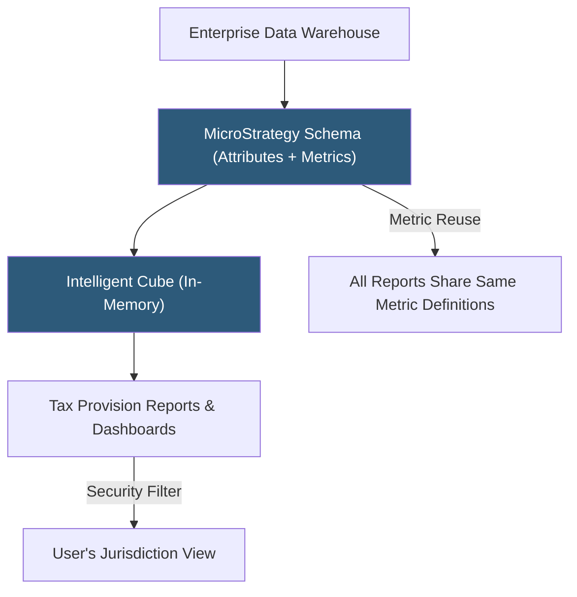

**Category:** Business Intelligence & Tax Analytics
**Difficulty:** Advanced
**Reading time:** 6 min read

---

MicroStrategy is an enterprise BI platform used by large organizations for high-volume financial and tax reporting requiring complex hierarchies, enterprise-grade security, and transaction-level data access. Its metadata-driven architecture and object reuse model make it suitable for global tax departments managing hundreds of standardized reports across thousands of entities.

- **Intelligent Cube** — MicroStrategy's in-memory data structure pre-loaded with filtered financial data for fast dashboard queries
- **Attribute** — A business entity in the MicroStrategy metadata model (account code, cost center, jurisdiction)
- **Metric** — A reusable calculated expression (sum of tax expense, ETR) defined once in the metadata catalog
- **Schema** — The enterprise data model mapping business attributes to physical database tables
- **Report** — A structured output combining attributes and metrics, rendered as grids or graphs
- **Document** — A presentation-quality formatted report supporting pixel-perfect financial statement layouts
- **Security filter** — Row-level security applied to a user's profile restricting database rows they can access
- **Narrowcast Server** — MicroStrategy component delivering personalized financial reports by email or portal on schedule

MicroStrategy's architecture centers on a metadata repository that stores the enterprise data model independently of the physical database. When a tax analyst creates a report using "Jurisdiction" and "Current Tax Expense," MicroStrategy translates these metadata objects into optimized SQL against the underlying warehouse, abstracting the physical schema from report authors.

Attributes in the tax schema represent dimensions: Legal Entity, Tax Jurisdiction, Fiscal Period, Account Code, Tax Type (current/deferred), and Difference Type (permanent/temporary). Metrics are defined as aggregations or formulas using these attributes, and once published to the metadata catalog, they appear consistently in every report and dashboard.

Intelligent Cubes pre-populate in memory with specific subsets of financial data (e.g., current year tax provision for all entities) to accelerate frequently run reports. Report designers can publish reports against an Intelligent Cube rather than the live warehouse, dramatically reducing query time for high-concurrency reporting periods like quarter-end close.

Security filters attach to user profiles in the MicroStrategy security model. A European tax controller's profile includes a filter `Jurisdiction.Region = 'EMEA'`, automatically applied to every report they run without requiring report designers to handle access control individually.

MicroStrategy Distribution Services (formerly Narrowcast) delivers scheduled financial reports by email as PDF or Excel attachments, replacing manual distribution of period-end tax summaries.

- Delivering standardized quarterly tax provision reports to 200+ legal entity controllers globally
- Building pixel-perfect tax disclosure documents meeting ASC 740 footnote format requirements
- Running high-concurrency ETR dashboards during earnings close without warehouse performance degradation
- Applying entity-level security to a single master tax provision report reused across all users
- Distributing scheduled tax reserve summaries by email to regional tax managers automatically

| Advantage | Disadvantage |
|-----------|--------------|
| Enterprise-grade security and audit trails for SOX compliance | High implementation and licensing cost relative to modern BI tools |
| Metadata-driven model ensures consistent metric definitions across thousands of reports | Steep learning curve for report authors and schema administrators |
| Intelligent Cubes handle high concurrency during period-end close | Metadata architecture requires dedicated MicroStrategy developers to maintain |
| Distribution Services automates formal tax report delivery | Modern UI less competitive than Tableau or Power BI for exploratory analytics |

- [Tableau Tax Analytics](tableau-tax-analytics.md)
- [SAP Analytics Cloud](sap-analytics-cloud.md)
- [Tax Data Warehouse Platforms](tax-data-warehouse-platforms.md)

---
*Part of the [Business Intelligence & Tax Analytics](index.md) category · [Back to Master Index](../../index.md)*
