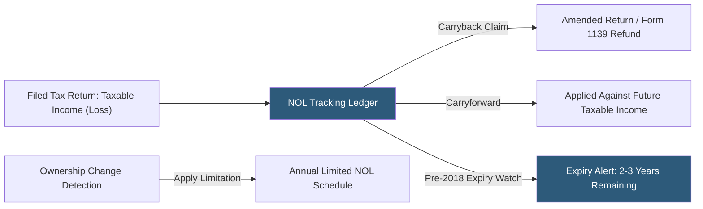

**Category:** Business Intelligence & Tax Analytics
**Difficulty:** Intermediate
**Reading time:** 6 min read

---

Net Operating Loss tracking maintains detailed records of losses generated in prior periods that can offset future taxable income, reducing future tax liability. Given the TCJA's shift to indefinite carryforward with 80% limitation for post-2017 NOLs, combined with the legacy 20-year expiration rules for pre-2018 NOLs, organizations with significant loss histories require rigorous tracking systems to maximize utilization and prevent inadvertent expirations.

- **Pre-2018 NOL** — Loss with 20-year carryforward and 2-year carryback, fully deductible against taxable income
- **Post-2017 NOL** — Loss with indefinite carryforward, no carryback (except farming), limited to 80% of taxable income
- **CARES Act carryback** — Temporary provision allowing 5-year carryback for 2018–2020 NOLs, creating refund opportunities
- **80% limitation** — The TCJA cap restricting annual NOL deduction to 80% of taxable income for post-2017 NOLs
- **Consolidated return NOL** — A group-level loss computed on the consolidated tax return
- **Separate company NOL** — An entity's NOL computed before consolidation, subject to SRLY rules in future years
- **State NOL** — A state-level NOL with state-specific carryforward periods and suspension rules
- **Section 382 annual limitation** — Cap on NOL utilization following an ownership change exceeding 50%

The NOL tracking ledger records each loss year as a separate row: entity (federal or state), vintage year, initial NOL amount, subsequent-year utilizations with the taxable income each offset, remaining balance, and applicable limitation. For consolidated returns, the group NOL is tracked in addition to each member's separate company losses.

Pre-2018 NOL vintages require active expiration monitoring: a 2019 NOL expires in 2039. The tracking system flags pre-2018 vintages with fewer than three years of carryforward remaining, triggering planning review for income acceleration strategies before expiration.

For post-2017 NOLs under the 80% limitation, the tracker models NOL utilization each year as the lesser of the available NOL and 80% of projected taxable income. This prevents incorrect assumptions that losses are fully utilized in the next profitable year.

CARES Act carrybacks (for 2018–2020 NOLs) required tracking which losses were carried back under the temporary 5-year carryback provision versus carried forward, as the returns generating those losses were amended. The refund received reduces the carryforward balance.

State NOL tracking runs separately because each state has different rules: California suspended NOL deductions for tax years 2020–2022 (limiting utilization), New York allows 20-year carryforward for pre-2015 losses and longer for recent losses, and some states do not allow consolidated return NOL sharing between group members.

- Tracking $500M of accumulated federal NOL carryforwards across 12 historical loss years
- Identifying pre-2018 NOL vintages expiring within 3 years requiring income acceleration planning
- Monitoring post-2017 NOL utilization against 80% annual limitation in the forecast model
- Reconciling consolidated group NOL to individual member separate company losses for SRLY compliance
- Documenting NOL carryback refund claims under CARES Act for audit support

| Advantage | Disadvantage |
|-----------|--------------|
| Systematic vintage tracking prevents pre-2018 expiration and permanent tax losses | Annual utilization entries require ongoing reconciliation to filed returns |
| 80% limitation modeling prevents optimistic assumptions in utilization projections | Pre vs post-2017 NOL tracking requires bifurcated system logic |
| SRLY tracking prevents return errors in consolidated group NOL deductions | State NOL rules vary by 44 jurisdictions, requiring extensive state law database |
| Carryback refund documentation supports IRS examination of amended returns | Section 382 limitation calculations for acquired entities require ownership history analysis |

- [Tax Attribute Tracking](tax-attribute-tracking.md)
- [Tax Credit Carryforward Management](tax-credit-carryforward-management.md)
- [Tax Scenario Planning](tax-scenario-planning.md)

---
*Part of the [Business Intelligence & Tax Analytics](index.md) category · [Back to Master Index](../../index.md)*
