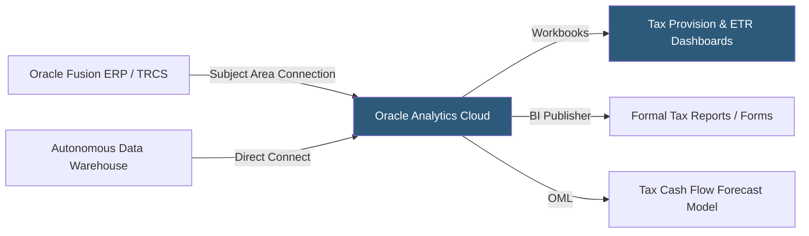

**Category:** Business Intelligence & Tax Analytics
**Difficulty:** Advanced
**Reading time:** 6 min read

---

Oracle Analytics Cloud (OAC) is Oracle's unified analytics platform integrating data preparation, machine learning, and visualization, deeply connected to Oracle ERP Cloud, Oracle Financials, and Oracle Tax Reporting Cloud. It is the preferred analytics layer for Oracle-centric finance and tax departments seeking integrated reporting across the Oracle application stack.

- **Oracle Analytics Subject Areas** — Pre-built semantic layers exposing Oracle Fusion financial data for BI reporting
- **Data flow** — OAC's ETL pipeline for transforming and enriching financial datasets before analysis
- **Workbook** — OAC's primary authoring canvas combining multiple visualizations and data sources
- **Oracle Tax Reporting Cloud (TRCS)** — Oracle's dedicated tax provision and reporting application that feeds OAC
- **Autonomous Data Warehouse (ADW)** — Oracle's cloud data warehouse to which OAC connects for large-scale financial analytics
- **OML (Oracle Machine Learning)** — In-database ML capabilities accessible from OAC for tax forecasting
- **Pixel-perfect reporting** — BI Publisher integration for formal financial statement and tax form layout
- **Semantic model** — OAC's metadata layer defining reusable business metrics, hierarchies, and security

Oracle Analytics Cloud connects to Oracle Fusion Financials and Oracle Tax Reporting Cloud through pre-built subject areas — semantic layers that map Oracle's complex data model to business-friendly terms. Tax analysts can build workbooks selecting Subject Area "Tax - Provision Summary" and immediately access tax jurisdiction, entity, period, and provision amount attributes without SQL knowledge.

For organizations running Oracle Tax Reporting Cloud (TRCS) for provision preparation, OAC provides integrated reporting by connecting to TRCS data cubes. Tax provision schedules, ETR components, deferred tax rollforwards, and uncertain tax positions stored in TRCS become available as dimensions and measures in OAC workbooks.

Data flows in OAC enable transformation of external financial data — connecting to flat files, databases, or REST APIs and applying join, aggregate, and formula operations. Prepared datasets feed into workbooks alongside live Oracle ERP subject areas, creating unified multi-source financial dashboards.

Oracle Machine Learning (OML) within ADW provides predictive capabilities accessible from OAC: time-series models for tax cash flow forecasting, anomaly detection for unusual tax accruals, and clustering of entities by tax profile similarity. These models can be invoked from OAC workbooks as enrichment columns.

BI Publisher integration generates pixel-perfect formatted tax outputs — structured provision workpapers, tax return support schedules, and regulatory filings — using Oracle's layout engine with conditional formatting, subtotals, and page breaks appropriate for formal financial documents.

- Building comprehensive tax provision dashboards connecting TRCS data to ERP general ledger
- Generating pixel-perfect ASC 740 disclosure support schedules using BI Publisher
- Creating multi-entity ETR dashboards from Oracle Fusion consolidated financials
- Applying OML time-series models to forecast quarterly cash tax payments
- Distributing automated tax summary reports from TRCS to regional controllers

| Advantage | Disadvantage |
|-----------|--------------|
| Pre-built Oracle ERP subject areas dramatically reduce implementation time | Best value for Oracle-centric organizations; weaker for non-Oracle ecosystems |
| Direct TRCS integration provides native tax provision analytics without ETL | UI less intuitive than Tableau or Power BI for exploratory analysis |
| BI Publisher provides pixel-perfect formal tax document generation | Subject area model is complex and requires Oracle metadata expertise |
| OML in ADW provides scalable ML without separate infrastructure | Licensing and OCI costs significant for large analytics user populations |

- [SAP Analytics Cloud](sap-analytics-cloud.md)
- [IBM Cognos Analytics](ibm-cognos-analytics.md)
- [Tax Data Warehouse Platforms](tax-data-warehouse-platforms.md)

---
*Part of the [Business Intelligence & Tax Analytics](index.md) category · [Back to Master Index](../../index.md)*
