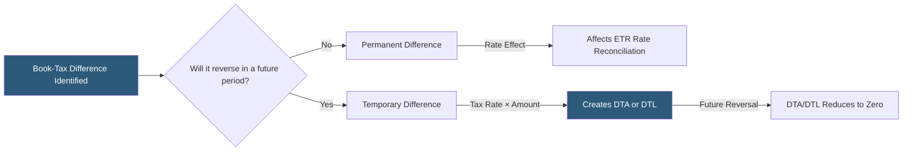

**Category:** Business Intelligence & Tax Analytics
**Difficulty:** Beginner
**Reading time:** 5 min read

---

Permanent and temporary differences are the two categories of book-to-tax divergences under ASC 740. Permanent differences affect only the current period's ETR since they never reverse, while temporary differences create deferred tax assets or liabilities that affect both current and future tax accounting. Correctly classifying each difference is foundational to accurate tax provision preparation.

- **Permanent difference** — A book-tax item that does not reverse: recognized for book but never for tax (or vice versa)
- **Temporary difference** — A book-tax item that reverses in future periods, generating a deferred tax asset or liability
- **Origin year** — The period in which a temporary difference first arises
- **Reversal year** — The future period when a temporary difference reverses, creating the offsetting tax effect
- **ETR impact** — Permanent differences change the ETR by adding or removing rate elements; temporary differences do not change the effective tax rate in isolation
- **Favorable vs unfavorable** — Favorable permanent differences reduce taxable income below book income; unfavorable increase it
- **Originating difference** — When a temporary difference first creates a DTA or DTL
- **Reversing difference** — When a previously created DTA or DTL is utilized

The key question for classifying a book-tax difference is whether it will ever reverse. A permanent difference is an item where the book treatment and tax treatment diverge in a way that is final — the item is either recognized for book but excluded from taxable income permanently, or included in taxable income but never recorded as a book expense.

Common favorable permanent differences: tax-exempt municipal bond interest (book income, excluded from taxable), dividends received deduction (reduces taxable income below book dividend income), qualified opportunity zone investment gains deferred indefinitely, and R&D credits (directly reduce tax rather than adjusting income).

Common unfavorable permanent differences: non-deductible meals (50% disallowed; the disallowed 50% is book expense but not a tax deduction), lobbying expenses, penalties and fines paid to government, and excess executive compensation under Section 162(m).

Temporary differences arise because of timing differences in recognizing the same income or expense. GAAP and tax recognize the item, but in different periods. Accelerated MACRS depreciation: tax deducts depreciation faster than book, creating a DTL in early years (book income > taxable income due to larger tax depreciation) that reverses in later years (book depreciation > tax depreciation). Deferred warranty revenue: tax may require earlier income inclusion than GAAP, creating a DTA that reverses when the GAAP revenue is eventually recognized.

Rate reconciliation items in the ETR footnote generally correspond to permanent differences (stated as a percentage of the statutory rate: "tax-exempt income -1.2%", "non-deductible compensation +0.8%"). Temporary differences create the deferred tax provision but typically do not appear separately in the rate reconciliation.

- Teaching junior tax accountants the distinction between permanent and temporary items
- Correctly separating ETR rate reconciliation items from deferred tax provision items
- Validating that deferred tax balances only reflect temporary differences, not permanent items
- Identifying when a new type of transaction creates a permanent vs temporary book-tax difference
- Explaining ASC 740 tax provision methodology to non-tax financial statement preparers

| Advantage | Disadvantage |
|-----------|--------------|
| Clear classification framework ensures consistent provision methodology | Some differences require judgment to classify (e.g., indefinitely deferred outside basis differences) |
| Permanent differences directly quantify the ETR impact for rate reconciliation | New tax legislation frequently creates new types of differences requiring classification analysis |
| Temporary difference tracking ensures DTA/DTL balances are complete | Complex transactions (acquisitions, sale-leasebacks) create both permanent and temporary components |
| Framework is consistent with ASC 740 and aligns with audit expectations | The distinction between permanent and temporary is not always black and white |

- [Book-to-Tax Differences](book-to-tax-differences.md)
- [Schedule M Adjustments](schedule-m-adjustments.md)
- [Effective Tax Rate (ETR) Analytics](effective-tax-rate-etr-analytics.md)

---
*Part of the [Business Intelligence & Tax Analytics](index.md) category · [Back to Master Index](../../index.md)*
