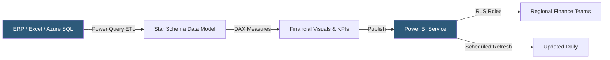

**Category:** Business Intelligence & Tax Analytics
**Difficulty:** Intermediate
**Reading time:** 6 min read

---

Power BI is Microsoft's business intelligence platform widely adopted in finance teams for building financial dashboards that connect to ERP systems, Excel models, and Azure data services. Its deep Microsoft 365 integration, DAX formula language, and Power Query data transformation capabilities make it a natural fit for organizations standardized on Microsoft infrastructure.

- **DAX (Data Analysis Expressions)** — Formula language for calculated columns, measures, and tables, including financial time-intelligence functions
- **Power Query** — ETL engine for transforming and cleaning financial data before loading into the model
- **Data model** — Star-schema relationships between fact tables (transactions) and dimension tables (accounts, entities, periods)
- **Measure** — A DAX expression evaluated in the context of filters applied by report interactions
- **Report vs Dashboard** — Reports contain interactive pages; dashboards are pin-based collections of visuals from reports
- **Row-level security (RLS)** — Filter rules applied to user roles restricting which entities or cost centers they can see
- **Dataflow** — Reusable Power Query transformation stored in Power BI Service for shared data preparation
- **Incremental refresh** — Policy to refresh only new or changed data partitions, enabling efficient daily close updates

Financial dashboards in Power BI are built in Power BI Desktop by connecting to data sources through Power Query. The transformation layer normalizes disparate financial data: removing duplicates, splitting GL account codes into segments, mapping cost centers to hierarchies, and reshaping wide budget spreadsheets into normalized fact tables.

The data model uses a star schema with a fact table of financial transactions linked to dimension tables for chart of accounts, cost centers, legal entities, and fiscal calendar. This structure enables DAX time-intelligence functions like `TOTALYTD`, `SAMEPERIODLASTYEAR`, and `PARALLELPERIOD` that are essential for period-over-period variance analysis.

DAX measures calculate KPIs such as gross margin percent, operating expense as a percent of revenue, and budget variance. Measures evaluate dynamically based on the filter context — selecting "Q2 2025" filters every measure to that period automatically.

Published to Power BI Service, dashboards are shared with finance teams via workspaces and apps. Row-level security ensures a business unit controller sees only their unit's data. Scheduled refresh connects to on-premises data through the Power BI Gateway or to cloud data sources directly, updating dashboards nightly after the GL close.

Power BI Premium and Fabric capacities support paginated reports (pixel-perfect layouts for formal financial statements) and large datasets beyond the standard 1GB model size limit.

- Building month-end close dashboards with actual vs budget waterfall charts
- Creating income statement and balance sheet reports from ERP data
- Tracking working capital metrics (DSO, DPO, inventory turns) with trend lines
- Distributing divisional P&L reports with automatic RLS-based personalization
- Publishing executive KPI scorecards embedded in SharePoint or Teams

| Advantage | Disadvantage |
|-----------|--------------|
| Deep Microsoft ecosystem integration (Excel, Teams, SharePoint) | DAX learning curve is steep for complex financial calculations |
| Power Query handles complex financial data normalization natively | Data model size limits apply in shared capacity tiers |
| Time-intelligence functions simplify period comparisons | On-premises ERP connections require Gateway maintenance |
| Paginated reports support pixel-perfect financial statement formats | Power BI Desktop is Windows-only; no native macOS authoring |

- [Power BI Tax Reporting](power-bi-tax-reporting.md)
- [Tableau Financial Analytics](tableau-financial-analytics.md)
- [Tax Data Warehouse Platforms](tax-data-warehouse-platforms.md)

---
*Part of the [Business Intelligence & Tax Analytics](index.md) category · [Back to Master Index](../../index.md)*
