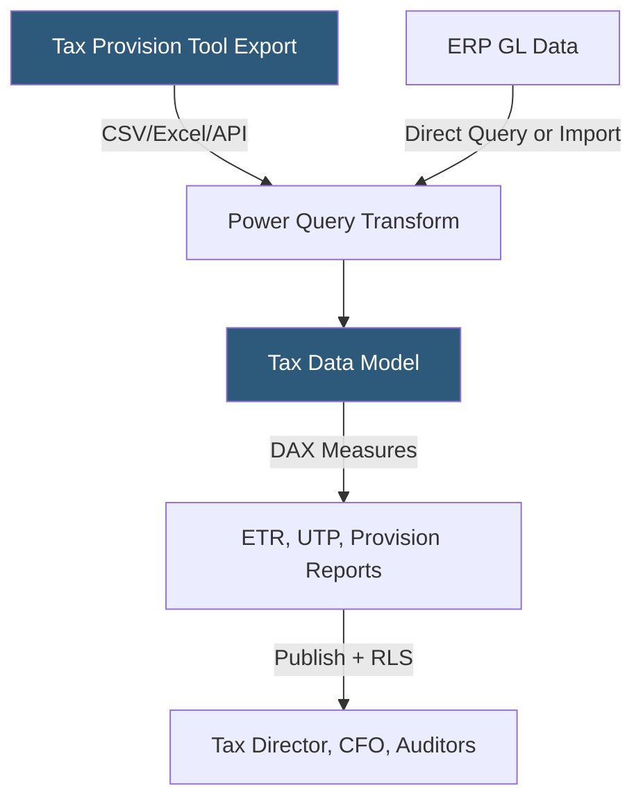

**Category:** Business Intelligence & Tax Analytics
**Difficulty:** Intermediate
**Reading time:** 6 min read

---

Power BI is used in tax departments to automate recurring tax reporting workflows, track tax positions across legal entities, and produce standardized reports for internal stakeholders and external auditors. Integration with tax provision systems and ERP general ledgers enables tax teams to replace manual Excel consolidations with governed, refreshable dashboards.

- **Tax provision report** — Summary of current and deferred tax by jurisdiction built from provision tool data
- **ASC 740 disclosures** — Financial statement footnote requirements driving tax dashboard content
- **Effective tax rate roll-forward** — DAX measure tracking ETR from prior period through drivers to current period
- **Uncertain tax position (UTP)** — Liability for tax positions with less than 50% likelihood of sustaining on audit
- **Cross-border tax allocation** — Distribution of consolidated tax expense to legal entities
- **Jurisdiction hierarchy** — Dimensional model organizing countries, states, and local jurisdictions
- **Book-to-tax measure** — DAX calculation comparing book income to taxable income for each M adjustment type
- **Tax calendar dimension** — Custom fiscal calendar table aligned to tax return filing deadlines

Power BI tax reporting begins with data ingestion from two primary sources: the tax provision system (exporting trial balances, M adjustments, and deferred tax schedules) and the ERP general ledger. Power Query transformations standardize entity names, map GL accounts to tax schedule lines, and create bridge tables between book and tax account codes.

The tax data model includes a fact table for tax line items (jurisdiction, entity, period, book amount, tax amount, difference) related to dimension tables for account codes, legal entities, periods, and tax types (current, deferred, temporary, permanent).

DAX measures compute the core tax analytics: ETR as `[Total Tax Expense] / [Pre-Tax Income]`, permanent difference impact as `[Permanent Diffs] * [Statutory Rate]`, and valuation allowance as a running balance from period opening. Time-intelligence measures calculate year-to-date tax expense and quarter-over-quarter ETR movement.

For uncertain tax positions, Power BI visualizes the UTP reserve balance by position, jurisdiction, and period, with drill-through to the supporting facts for each position. This replaces manual UTP tracking spreadsheets with a governed, auditable dashboard.

Published reports support external auditor access through limited Power BI Service guest access, providing read-only views of tax schedules without exposing underlying source data. Row-level security restricts each entity's finance team to their own jurisdiction data.

- Automating quarterly ETR calculation and disclosure package preparation
- Tracking uncertain tax position (UTP) reserves across all legal entities
- Producing ASC 740 footnote support schedules with drill-down capability
- Monitoring deferred tax asset/liability roll-forward by temporary difference category
- Distributing entity-level tax provision summaries to local finance controllers

| Advantage | Disadvantage |
|-----------|--------------|
| Replaces manual Excel consolidations with governed, refreshable reports | Tax provision data export formats vary by tool requiring custom Power Query |
| DAX time-intelligence simplifies quarter-over-quarter ETR analysis | Complex ASC 740 calculations require advanced DAX patterns |
| Row-level security enables auditor access without exposing source data | Auditor review of Power BI requires familiarity with the platform |
| Published reports ensure tax team uses consistent, approved numbers | Scheduled refresh must align with provision tool data availability |

- [Power BI Financial Dashboards](power-bi-financial-dashboards.md)
- [Effective Tax Rate (ETR) Analytics](effective-tax-rate-etr-analytics.md)
- [Tax Data Warehouse Platforms](tax-data-warehouse-platforms.md)

---
*Part of the [Business Intelligence & Tax Analytics](index.md) category · [Back to Master Index](../../index.md)*
