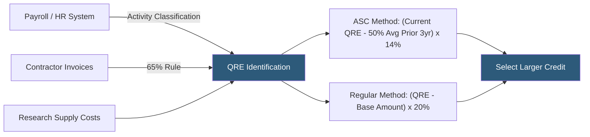

**Category:** Business Intelligence & Tax Analytics
**Difficulty:** Advanced
**Reading time:** 7 min read

---

The Research and Development (R&D) tax credit is a federal and state income tax credit for qualified research expenses. Analytics platforms calculate eligible credits by classifying payroll, contract research, and supply costs against IRS four-part test criteria, applying either the regular credit method or the Alternative Simplified Credit (ASC) method, whichever yields the larger benefit.

- **Four-part test** — IRS criteria that qualified research must be (1) technological in nature, (2) for a permitted purpose, (3) an elimination of technical uncertainty, and (4) a process of experimentation
- **Qualified Research Expenses (QRE)** — Wages, contractor costs (65%), and supply costs that qualify for the credit
- **Regular Credit method** — 20% credit on QREs above a base amount calculated from historical research intensity
- **Alternative Simplified Credit (ASC)** — 14% credit on QREs exceeding 50% of the average QREs for the prior three years
- **Base period** — The 1984–1988 period used in the regular credit method historical calculation
- **Credit carryforward** — The 20-year carryforward period for unused federal R&D credits
- **Section 41** — Internal Revenue Code section defining the R&D credit
- **State R&D credits** — Separate credit computations for each state with a qualifying research credit program

R&D credit calculation begins with identifying qualified research expenses from three cost categories. Wages are the largest component: payroll data is analyzed to identify employees whose time involves qualified research activities (software development, process improvement experimentation, product design testing). Each employee's wages are multiplied by their percentage of time spent on qualified activities, determined through time tracking analysis or business component-level allocation studies.

Contract research expenses are eligible at 65% of the amount paid to contractors performing qualified research on behalf of the company. Contract cost analytics match invoice data to qualifying projects and apply the 65% factor.

Supply costs include tangible supplies used and consumed in the research process — not general administrative supplies or equipment. Capital asset purchases are excluded.

The ASC method (most commonly used since the regular credit requires 1984–1988 base period data unavailable for most companies) calculates the credit as 14% of QREs exceeding 50% of the average annual QREs for the three preceding tax years. If the taxpayer has fewer than three prior years of QREs, a reduced rate formula applies.

State R&D credit analytics run in parallel: each state has its own credit rate, QRE definition, and base period calculation. California's credit rate is 15%/24% (small business), New York is 9%, and Texas offers a franchise tax credit. State analytics aggregate the appropriate QREs per state nexus and apply each state's formula independently.

- Calculating federal and state R&D credits from software development payroll records
- Identifying qualifying contract research expenses from vendor invoices for biotech studies
- Running annual credit studies comparing ASC vs regular method to maximize the benefit
- Tracking and projecting the utilization of credit carryforward balances against projected tax liability
- Analyzing the credit impact of hiring or contractor decisions in qualifying research activities

| Advantage | Disadvantage |
|-----------|--------------|
| Systematic payroll analytics identifies QREs across thousands of employees | Four-part test classification requires tax attorney or R&D specialist review for each business component |
| ASC method simplifies calculation by eliminating the need for 1984–1988 base data | Activity surveys require employee time, reducing participation rates |
| State credit analytics can double the total credit benefit with minimal incremental effort | IRS audit scrutiny of R&D credits is high; documentation must withstand examination |
| Annual credit calculations identify year-over-year trends for planning | Contractor 65% limitation requires contract language review to confirm eligibility |

- [Tax Opportunity Identification](tax-opportunity-identification.md)
- [Investment Tax Credit Tracking](investment-tax-credit-tracking.md)
- [Tax Attribute Tracking](tax-attribute-tracking.md)

---
*Part of the [Business Intelligence & Tax Analytics](index.md) category · [Back to Master Index](../../index.md)*
