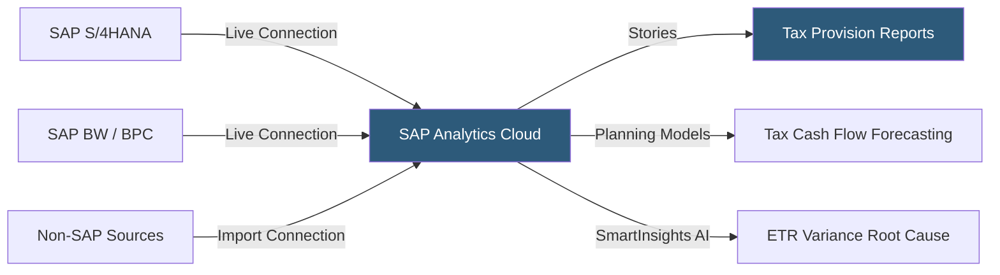

**Category:** Business Intelligence & Tax Analytics
**Difficulty:** Advanced
**Reading time:** 7 min read

---

SAP Analytics Cloud (SAC) integrates business intelligence, planning, and predictive analytics within SAP's ecosystem, making it the natural choice for organizations running SAP S/4HANA or SAP BPC for financial and tax consolidation. Its live connections to SAP systems eliminate data replication for financial reporting while its planning module supports tax forecasting and scenario modeling.

- **Live Connection** — Real-time query connection to SAP S/4HANA, SAP BW, or SAP HANA without data extract
- **Import Connection** — Extract-based connection to non-SAP data sources cached in SAC's in-memory store
- **Story** — SAP's term for an analytics report combining charts, tables, and narrative in a page-based layout
- **Planning model** — A writable data structure supporting tax forecasting, budget entry, and scenario planning
- **Smart Insights** — AI-powered root cause analysis identifying drivers of financial metric changes
- **Smart Predict** — Integrated machine learning for tax cash flow forecasting and anomaly detection
- **BTP (Business Technology Platform)** — SAP's cloud integration layer connecting SAC to third-party data
- **Digital Boardroom** — Presentation mode aggregating multiple SAC stories into an executive briefing view

SAP Analytics Cloud's live connections to SAP S/4HANA use the SAP HANA real-time engine to execute queries directly against the HANA database, returning financial results in seconds without extract processes. This is critical for tax departments that need current-period data during close rather than day-old extracts.

Stories are built using a responsive canvas where analysts drag KPI tiles, charts, and tables, then bind them to data models through the Builder panel. For tax reporting, stories typically combine an ETR trend chart (live from HANA), a tax provision table (showing current and deferred by entity), and jurisdiction map visualizations.

The planning module enables tax forecasting in a writeback model where users enter tax estimates, which flow into consolidated forecasts. Version management supports multiple tax scenarios (base case, tax reform scenario, aggressive planning scenario) that can be compared on a single story.

Smart Insights performs automated root cause analysis by clicking on a data point and asking SAC to explain why Q3 ETR differs from Q2. The AI analyzes all available dimensions and returns a ranked list of drivers (e.g., "60% explained by change in valuation allowance, 25% by GILTI inclusion").

SAP Digital Boardroom assembles multiple SAC stories into a touchscreen-optimized executive presentation, enabling the CFO to navigate from consolidated P&L to tax provision details to jurisdiction analysis in a single meeting.

- Building real-time tax provision dashboards on live S/4HANA financial data without ETL
- Comparing consolidated ETR across multiple tax reform scenarios using planning models
- Delivering tax-adjusted financial forecasts integrated with SAP's financial planning cycle
- Automating AI-driven root cause analysis for unexpected ETR movements
- Building Digital Boardroom presentations for quarterly earnings reviews

| Advantage | Disadvantage |
|-----------|--------------|
| Live S/4HANA connections eliminate ETL for SAP-centric organizations | Limited value for organizations not on SAP ERP ecosystem |
| Planning module integrates tax forecasting with enterprise financial plan | High licensing costs; typically bundled with SAP enterprise agreements |
| Smart Insights automates analysis that would take analysts hours manually | Story authoring is more complex than Power BI or Tableau equivalents |
| Consistent financial semantics from SAP BW/BPC metadata layer | Non-SAP data integration through import connections has latency |

- [Oracle Analytics Cloud](oracle-analytics-cloud.md)
- [MicroStrategy Tax Analytics](microstrategy-tax-analytics.md)
- [Tax Data Warehouse Platforms](tax-data-warehouse-platforms.md)

---
*Part of the [Business Intelligence & Tax Analytics](index.md) category · [Back to Master Index](../../index.md)*
