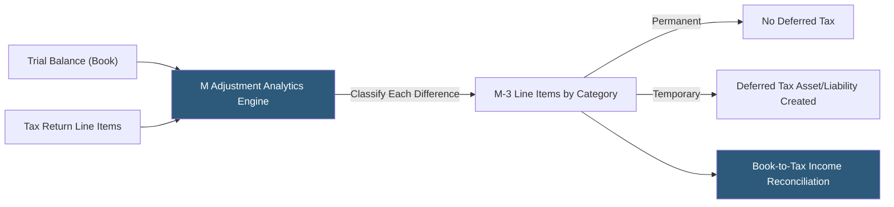

**Category:** Business Intelligence & Tax Analytics
**Difficulty:** Intermediate
**Reading time:** 6 min read

---

Schedule M-1 and M-3 adjustments reconcile a corporation's book income (per financial statements) to taxable income on the tax return. Analytics tools automate M adjustment identification from trial balance data, categorize permanent and temporary differences, and validate the reconciliation for accuracy and completeness.

- **Schedule M-1** — Form 1120 schedule reconciling book income to taxable income for smaller corporations
- **Schedule M-3** — Detailed M reconciliation required for corporations with total assets ≥$10M, breaking down income and deductions into book vs tax with difference by category
- **Permanent difference** — A book-tax item that never reverses: tax-exempt interest, non-deductible meals, officer life insurance
- **Temporary difference** — A book-tax item that reverses over time: depreciation timing, prepaid income, bad debt reserves
- **Book income (Part I, M-3)** — Financial statement net income before income tax expense
- **Tax return income** — Taxable income on the face of Form 1120
- **M item** — Each line on Schedule M-1 or M-3 representing a specific book-tax reconciling item
- **E&P adjustment** — M adjustments also flow into earnings and profits calculations for dividend planning

M adjustment analytics compare each income and deduction category between the financial statement trial balance and the tax return, computing the difference and classifying it as a specific M-3 line item. The analytics maintain a mapping table connecting GL account codes to M-3 line categories, updated annually for changes in tax law or financial statement presentation.

Common permanent differences computed in M analytics: meals and entertainment (50% disallowance, 100% for pre-TCJA entertainment), officer life insurance premiums, lobbying expenses, penalties and fines, stock-based compensation (excess tax deduction over book expense for vested RSUs and ISOs), and tax-exempt state and municipal bond interest.

Common temporary differences: GAAP depreciation vs MACRS tax depreciation (the largest for capital-intensive companies), deferred revenue timing differences, warranty reserves not yet deductible, bad debt allowances vs specific charge-offs, and prepaid rent in excess of straight-line.

For Schedule M-3, each difference is categorized as either income/gain or deduction/loss, and further broken down into its book amount, temporary difference, permanent difference, and tax amount. The analytics validate that the sum of all M items plus book income equals taxable income.

The M adjustments feed the ASC 740 deferred tax calculation: temporary differences create deferred tax assets (items deductible for book but not yet for tax) or deferred tax liabilities (items deducted for tax but not yet for book).

- Automating M-3 preparation from trial balance and tax return data for large public companies
- Identifying unrecorded M adjustments through variance analysis between book and tax accounts
- Validating that deferred tax balances agree with cumulative M temporary differences
- Tracking year-over-year M item trends to identify unusual book-tax divergences requiring review
- Computing E&P adjustments from M items for controlled foreign corporation dividend calculations

| Advantage | Disadvantage |
|-----------|--------------|
| Automated M analysis from trial balance reduces manual computation time | GL account-to-M-3 category mapping requires annual review and maintenance |
| Systematic classification prevents omission of common M adjustments | Complex transactions (leases, derivatives, restructurings) require custom M analysis |
| Deferred tax reconciliation validates ASC 740 balances against M temporary differences | M-3 detail level (60+ categories) requires comprehensive data from both book and tax records |
| Trend analysis identifies M items that may signal aggressive tax positions | Some M items require judgment about permanent vs temporary classification |

- [Book-to-Tax Differences](book-to-tax-differences.md)
- [Permanent vs. Temporary Differences](permanent-vs-temporary-differences.md)
- [Effective Tax Rate (ETR) Analytics](effective-tax-rate-etr-analytics.md)

---
*Part of the [Business Intelligence & Tax Analytics](index.md) category · [Back to Master Index](../../index.md)*
