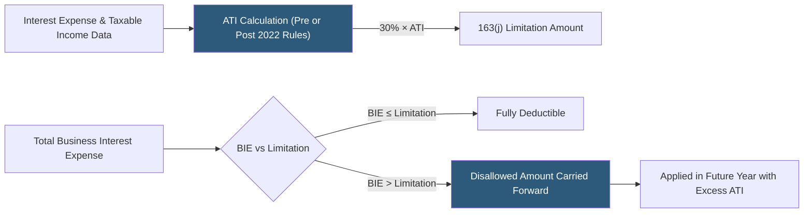

**Category:** Business Intelligence & Tax Analytics
**Difficulty:** Advanced
**Reading time:** 6 min read

---

Section 163(j) limits deductible business interest expense to 30% of adjusted taxable income (ATI), plus business interest income and floor plan financing. Analytics tools calculate the limitation for each entity and consolidated group, track disallowed interest carryforwards, and model planning strategies to maximize deductibility.

- **Business interest expense (BIE)** — Interest paid or accrued on debt allocable to a trade or business
- **Adjusted taxable income (ATI)** — Taxable income before business interest, NOLs, and (through 2021) depreciation and amortization
- **30% ATI limitation** — The annual cap on deductible business interest: 30% × ATI + business interest income
- **EBITDA-based ATI (pre-2022)** — Through 2021, ATI added back depreciation, depletion, and amortization (similar to EBITDA)
- **EBIT-based ATI (post-2021)** — From 2022, ATI no longer adds back D&A, resulting in a lower ATI base and higher disallowance
- **Disallowed interest carryforward** — Excess BIE that cannot be deducted in the current year and carries forward indefinitely
- **Real property trade or business election** — Irrevocable election to use ADS depreciation in exchange for exemption from 163(j)
- **Partnership and S corporation rules** — Special rules applying 163(j) at the entity level and limiting partner allocation of excess limitation

The Section 163(j) limitation calculation begins with determining ATI for each separate filer or consolidated return group. For tax years 2022 and beyond, ATI is essentially taxable income before business interest expense and income, business interest deduction, NOL deduction, and the Section 199A deduction — but no longer adding back depreciation and amortization. This change substantially reduced ATI for capital-intensive businesses.

Business interest expense is the interest paid or accrued on debt properly allocable to a trade or business. Investment interest and interest on dealer/floor plan financing is excluded. The limitation is 30% of ATI plus business interest income from the same trade or business.

When BIE exceeds the limitation, the excess is disallowed and carried forward indefinitely as a disallowed business interest carryforward. In subsequent years, carryforward BIE is deductible to the extent the entity has excess limitation (the difference between the current-year 163(j) limitation and current-year BIE).

Planning analytics model the impact of the real property trade or business election: entities electing out of 163(j) must use the Alternative Depreciation System (longer lives), which increases depreciation deductions but eliminates the interest limitation. The analytics compare the NPV of additional depreciation from ADS versus the value of full interest deductibility.

Partnership rules create additional complexity: 163(j) applies at the partnership level, partners cannot deduct their allocable share of disallowed interest, and excess limitation cannot be used by partners. Analytics track partnership-level limitation separately from the partner's own return.

- Calculating annual 163(j) limitation and disallowed interest carryforward for a leveraged buyout entity
- Modeling the NPV impact of the real property election for a REIT or real estate operating company
- Tracking disallowed interest carryforward balances across multiple years and consolidated group members
- Projecting future year deductibility of carryforward BIE against ATI growth forecasts
- Analyzing the 163(j) impact of proposed debt refinancing or capital structure changes

| Advantage | Disadvantage |
|-----------|--------------|
| Automated ATI calculation prevents computational errors in complex consolidations | Post-2021 EBIT-based ATI significantly reduces limitation for capital-intensive businesses |
| Carryforward tracking ensures deduction is captured in future years with excess ATI | Real property election is irrevocable, requiring careful NPV analysis before making it |
| Planning models quantify the debt vs equity tradeoff under the 163(j) framework | Partnership allocation rules for 163(j) are complex, especially with tiered structures |
| Consolidated group 163(j) requires inter-member interest allocation analysis | ATI computation requires coordination with other tax adjustments (NOLs, Section 199A) |

- [Section 174 R&D Capitalization](section-174-rd-capitalization.md)
- [Tax Scenario Planning](tax-scenario-planning.md)
- [NOL (Net Operating Loss) Tracking](nol-net-operating-loss-tracking.md)

---
*Part of the [Business Intelligence & Tax Analytics](index.md) category · [Back to Master Index](../../index.md)*
