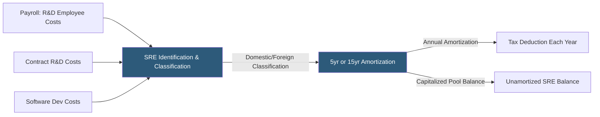

**Category:** Business Intelligence & Tax Analytics
**Difficulty:** Advanced
**Reading time:** 6 min read

---

The Tax Cuts and Jobs Act (TCJA) amended Section 174 to require capitalization and amortization of Specified Research and Experimental (SRE) expenditures beginning in 2022, ending the longstanding option to deduct these costs immediately. Analytics tools identify qualifying expenditures, calculate the 5-year (domestic) or 15-year (foreign) amortization, track unamortized balances, and model cash tax impact compared to prior-law expensing.

- **Specified R&E expenditures** — Costs for developing or improving a product, process, formula, invention, computer software, or technique
- **Section 174(b) amortization** — 5-year amortization (60-month, mid-year convention) for domestic SRE; 15-year for foreign SRE
- **Mid-year convention** — First-year deduction is only half a year's amortization regardless of when costs were incurred
- **Software development** — Explicitly included in SRE requiring capitalization under amended Section 174
- **Contract research** — Payments to outside contractors for SRE also qualify (unlike R&D credit contractor limitation)
- **Section 41 interaction** — QRE for R&D credit purposes often overlaps with Section 174 SRE, but with different cost bases
- **Amortization pool** — The cumulative unamortized balance of capitalized SRE requiring tracking by vintage year
- **Cash tax impact** — Capitalization increases current-year taxable income and tax payments vs prior-law immediate expensing

Section 174 analytics begin with identifying all expenditures that meet the definition of SRE — costs incident to the development or improvement of a product, process, formula, invention, computer software, or technique. This scope is broader than the Section 41 R&D credit definition and includes costs that were previously deductible under the old Section 174 but did not qualify for the R&D credit.

Software development costs are a significant new category: internal payroll costs for software engineers developing proprietary software must now be capitalized and amortized, whereas previously many companies deducted them currently (or under Section 174's pre-2022 rules). Analytics classify software projects as qualifying SRE by function code and project type.

The amortization schedule uses the straight-line method with a mid-year convention: domestic SRE amortizes over 60 months, with only 6 months of amortization in year one (regardless of when in the year the costs were incurred). Foreign SRE amortizes over 180 months with the same mid-year convention.

Each year, a new amortization pool is created for that year's SRE expenditures, tracked separately by domestic and foreign classifications. The cumulative unamortized balance represents a deferred tax asset (the book-tax timing difference), which requires tracking under ASC 740.

Cash tax impact modeling compares the post-2022 amortized deduction to the hypothetical full expensing deduction, quantifying the timing difference and the associated increase in current-year tax payments.

- Identifying all qualifying SRE expenditures including newly in-scope software development costs
- Computing the amortization deduction by vintage year for domestic and foreign SRE pools
- Modeling the cumulative deferred tax asset created by the book-tax timing difference
- Projecting the multi-year cash tax impact of SRE capitalization versus prior-law expensing
- Coordinating Section 174 SRE identification with Section 41 R&D credit QRE calculation

| Advantage | Disadvantage |
|-----------|--------------|
| Systematic identification prevents omission of qualifying SRE categories | Capitalization creates immediate cash tax cost increase requiring liquidity planning |
| Amortization pool tracking ensures correct deduction in all future years | Mid-year convention creates deduction shortfall in first year of SRE spending |
| Deferred tax asset tracking provides ASC 740 support for the timing difference | Foreign SRE 15-year amortization significantly delays cost recovery for offshore R&D |
| Interaction modeling with Section 41 optimizes the combined credit and deduction position | Repeal of Section 174 capitalization has been proposed but not enacted, creating planning uncertainty |

- [R&D Tax Credit Calculation](rd-tax-credit-calculation.md)
- [Section 163(j) Interest Limitation](section-163j-interest-limitation.md)
- [Tax Attribute Tracking](tax-attribute-tracking.md)

---
*Part of the [Business Intelligence & Tax Analytics](index.md) category · [Back to Master Index](../../index.md)*
