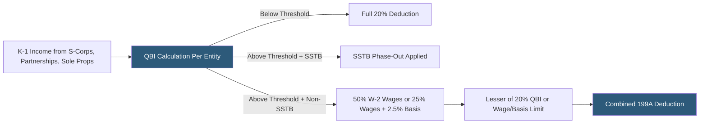

**Category:** Business Intelligence & Tax Analytics
**Difficulty:** Intermediate
**Reading time:** 6 min read

---

The Section 199A Qualified Business Income (QBI) deduction allows eligible pass-through business owners to deduct up to 20% of their qualified business income, reducing the effective tax rate on pass-through income. Analytics calculate the deduction across multiple pass-through entities, apply wage/property limitations, and model planning strategies to maximize the benefit.

- **Qualified Business Income (QBI)** — Net ordinary business income from a qualified trade or business, excluding investment items
- **Specified Service Trade or Business (SSTB)** — Service businesses (health, law, consulting, financial services) with phased-out deduction above income thresholds
- **W-2 wage limitation** — For high-income taxpayers, deduction limited to the greater of 50% of W-2 wages or 25% of wages plus 2.5% of unadjusted basis of qualified property
- **Threshold amounts** — Phase-in range: $182,050–$232,050 (single) and $364,100–$464,200 (MFJ) for 2024
- **QBI loss carryforward** — Net QBI losses from one year carry forward to reduce QBI in the next year
- **Aggregation election** — Option to combine multiple pass-through activities into one QBI calculation, enabling one entity's wages to support another
- **Qualified REIT dividends** — REIT dividends treated as QBI eligible for the 20% deduction without wage limitation
- **Cooperative dividends** — Patronage dividends from agricultural cooperatives qualifying for special QBI treatment

Section 199A analytics consolidate K-1 income information from all pass-through entities in which the taxpayer has an interest. For each entity, the analytics identify ordinary business income (excluding capital gains, dividends, and investment income) and classify the business as SSTB or non-SSTB based on its principal activity code.

Below the threshold, the deduction is simply 20% of QBI. Above the threshold, the deduction is the lesser of 20% of QBI and the W-2 wage/property limitation. The wage limitation is the greater of: (a) 50% of W-2 wages allocable to the qualified business, or (b) 25% of W-2 wages plus 2.5% of the unadjusted basis of qualified depreciable property placed in service in the current or prior 10 years.

For SSTB entities, the income, wages, and property are phased down proportionally within the phase-in range: at 100% above the top threshold, no QBI, wages, or property from an SSTB can be included.

Aggregation elections allow combining entities that share common ownership and meet integration tests. Analytics model the aggregation, identifying combinations where one entity's wages support another entity's QBI that would otherwise face a binding wage limitation.

QBI loss carryforwards from net negative QBI in one year reduce QBI in the next year across all entities. Analytics track carryforward balances separately for each SSTB and non-SSTB activity.

- Computing 199A deduction for a high-income taxpayer with income from 5 S-corporations and 3 partnerships
- Modeling the wage limitation impact and identifying optimal compensation levels to support the deduction
- Analyzing the SSTB phase-out for a financial services business owner near the income threshold
- Evaluating aggregation election strategies to maximize the combined wage/property limitation
- Projecting multi-year QBI deduction as income grows above the threshold requiring wage limitation analysis

| Advantage | Disadvantage |
|-----------|--------------|
| 20% effective rate reduction is significant tax savings for qualifying business owners | SSTB classification creates cliff effects for service business owners near thresholds |
| Aggregation modeling identifies entity combination strategies to maximize wages | Aggregation election is irrevocable for the year made, requiring careful modeling |
| Wage optimization planning quantifies compensation structure impact on deduction value | Deduction is scheduled to expire after 2025 without legislative extension, creating planning uncertainty |
| Analytical tracking of QBI loss carryforwards prevents omission in future year returns | K-1 data quality and completeness affects analytics accuracy |

- [Partnership K-1 Allocation](partnership-k-1-allocation.md)
- [Tax Scenario Planning](tax-scenario-planning.md)
- [Tax Opportunity Identification](tax-opportunity-identification.md)

---
*Part of the [Business Intelligence & Tax Analytics](index.md) category · [Back to Master Index](../../index.md)*
