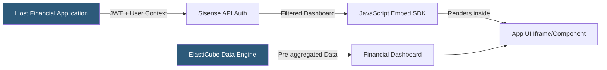

**Category:** Business Intelligence & Tax Analytics
**Difficulty:** Advanced
**Reading time:** 6 min read

---

Sisense specializes in embedded analytics, allowing financial software vendors and enterprise applications to embed interactive dashboards and reports directly within their product interfaces. Its ElastiCube in-memory engine and JavaScript Embed SDK enable white-labeled financial analytics experiences without users leaving their primary application.

- **ElastiCube** — Sisense's columnar in-memory data engine optimized for aggregating large financial datasets
- **Embedded SDK** — JavaScript library for embedding Sisense dashboards, widgets, and filters into host applications
- **White-label** — Capability to fully rebrand Sisense dashboards to match the host application's visual identity
- **Single-tenant vs multi-tenant** — Deployment architecture controlling data isolation between customers in embedded scenarios
- **iFrame vs JavaScript embed** — Two embedding approaches: simple iFrame for quick integration vs JavaScript API for deep customization
- **Row-level security** — JWT-based mechanism passing user identity to Sisense for data restriction at embed time
- **Custom plugins** — Extensions that add custom visualization types or data processing to ElastiCube builds
- **Fusion Embed** — Sisense's latest embedding framework combining React components with REST APIs

Embedded analytics with Sisense begins with connecting financial data to ElastiCube, which ingests from data warehouses, flat files, and REST APIs, then pre-aggregates data for fast query response. The ElastiCube build process compresses and indexes data into columnar format, enabling sub-second responses to complex financial aggregations across millions of transactions.

The host application authenticates users against Sisense using JSON Web Tokens (JWTs) containing the user's identity and tenant context. Sisense uses this JWT to apply the appropriate row-level security rules — ensuring each organization's users only see their own financial data when dashboards are embedded in a multi-tenant product.

Embedding is achieved through the Sisense JavaScript Embed SDK. The host application loads the SDK, initializes it with the Sisense server URL and JWT, and then calls methods to embed specific dashboards or individual widgets by ID. Deep customization includes applying theme colors, hiding toolbar elements, adding custom CSS, and intercepting drill-down events to navigate within the host application rather than Sisense.

The Fusion Embed framework provides a React component library for building composite embedded experiences that combine Sisense visualizations with host application UI components, enabling tightly integrated financial modules within SaaS products.

- Embedding financial reporting dashboards directly within an ERP or accounting SaaS product
- Providing customers of a financial platform with white-labeled analytics in their product experience
- Building multi-tenant financial analytics where each customer sees only their own data
- Integrating real-time financial KPI widgets into an operations management portal
- Delivering embedded ESG reporting within a corporate sustainability platform

| Advantage | Disadvantage |
|-----------|--------------|
| White-label capability provides seamless branded experience | ElastiCube builds require significant memory and compute resources |
| JWT-based multi-tenancy scales to many customers in a single deployment | Embedding complexity requires developer resources in the host application |
| Pre-aggregated ElastiCube delivers fast responses on complex financial data | ElastiCube rebuild times can delay data freshness for real-time use cases |
| Fusion Embed supports deep UI integration beyond simple iFrame embedding | Higher cost compared to DIY charting libraries for simpler use cases |

- [Looker (Google) Financial Analytics](looker-google-financial-analytics.md)
- [ThoughtSpot Search Analytics](thoughtspot-search-analytics.md)
- [Tax Dashboard Visualization](tax-dashboard-visualization.md)

---
*Part of the [Business Intelligence & Tax Analytics](index.md) category · [Back to Master Index](../../index.md)*
