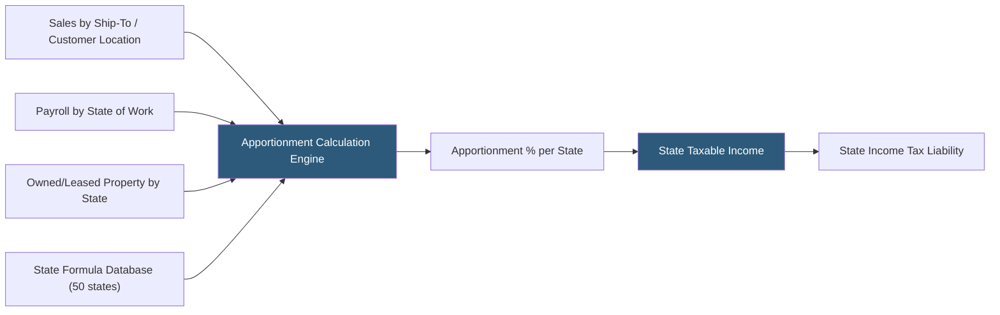

**Category:** Business Intelligence & Tax Analytics
**Difficulty:** Advanced
**Reading time:** 7 min read

---

State tax apportionment analytics determines the portion of a corporation's income subject to tax in each state where it has nexus, using formulas based on sales, property, and payroll factors. With 44 states imposing corporate income tax and each applying different apportionment formulas, factor analytics is critical for minimizing state tax liability and ensuring accurate state tax return preparation.

- **Apportionment factor** — A fraction (numerator = in-state, denominator = total) calculated for sales, property, and payroll
- **Single sales factor** — An apportionment formula using only the sales factor, adopted by most states since 2000
- **Three-factor formula** — The traditional Uniform Division of Income for Tax Purposes Act (UDITPA) formula equally weighting sales, property, and payroll
- **Market-based sourcing** — Assigning service receipts to where the customer receives the benefit, now used by most states
- **Cost-of-performance sourcing** — Older method assigning service receipts to where the service is performed
- **Throwback rule** — State rule including sales to states where the company lacks nexus in the numerator of the throwback state's sales factor
- **Joyce vs Finnigan** — Alternative interpretations of how unitary group members' factors are included in combined filings
- **Public Law 86-272** — Federal law limiting states from taxing income from solicitation-only interstate sales of tangible personal property

State apportionment analytics begins with sourcing comprehensive data for the three traditional factors. Sales factor data requires classifying each customer's revenue transaction to the customer's location (for market-based sourcing of services) or the ship-to address (for sales of tangible property). For service companies, state-specific sourcing rules determine whether to use customer location, customer billing address, or location where services are used.

Property factor data comes from the fixed asset register (owned property, at gross basis) plus capitalized lease values for each state. Payroll factor data comes from payroll systems, allocating wages to the state where each employee provides services.

The apportionment engine applies each state's specific formula: most states now use single sales factor, but several (including states with "double-weighted" sales) apply different weights. The engine maintains a database of current state formulas updated for legislative and regulatory changes annually.

Throwback rule analytics identify sales where the destination state does not have nexus (due to Public Law 86-272 protection or below-threshold activity) and add those sales back to the origin state's sales factor numerator, increasing the origin state's apportionment and taxable income.

Combined reporting states require unitary group analysis — determining which entities are part of the unitary business (sharing common management, intercompany transactions, functional integration) and combining their factors across the group. Joyce vs Finnigan state classification (affecting whether out-of-state entities' factors are included) requires state-specific rule application.

- Computing state apportionment factors for 35-state combined reporting filings
- Identifying states where throwback rules increase taxable income relative to return positions
- Modeling the apportionment impact of moving sales staff, offices, or warehouses between states
- Reconciling state apportionment to federal return income for combined group members
- Analyzing the ETR impact of states transitioning from three-factor to single sales factor formulas

| Advantage | Disadvantage |
|-----------|--------------|
| Automated factor calculation across 44 states replaces manual spreadsheet processes | State formula database requires constant maintenance as laws change through legislation and regulations |
| Market-based sourcing analytics identify optimal filing positions across service categories | Unitary group determination requires legal analysis beyond data analytics alone |
| Throwback analysis prevents underreporting in origin states | Sales sourcing complexity for digital products and platform services varies by state interpretation |
| Combined reporting analysis identifies planning opportunities in Joyce vs Finnigan states | Complex intercompany transactions require arm's-length analysis before apportionment calculation |

- [Tax Attribute Tracking](tax-attribute-tracking.md)
- [Tax Opportunity Identification](tax-opportunity-identification.md)
- [NOL (Net Operating Loss) Tracking](nol-net-operating-loss-tracking.md)

---
*Part of the [Business Intelligence & Tax Analytics](index.md) category · [Back to Master Index](../../index.md)*
