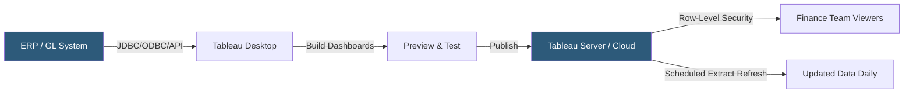

**Category:** Business Intelligence & Tax Analytics
**Difficulty:** Intermediate
**Reading time:** 6 min read

---

Tableau is a leading data visualization platform used extensively in finance and tax departments to transform raw financial data into interactive dashboards, trend reports, and drill-down analyses. Its drag-and-drop interface, native connections to financial data sources, and calculated field capabilities make it a preferred tool for building financial analytics workflows without requiring SQL expertise.

- **Data source connection** — Tableau's ability to connect live or extract data from ERP systems, databases, and spreadsheets
- **Calculated field** — Custom formulas using Tableau's formula language to derive financial metrics like EBITDA, variance %, or effective tax rate
- **Dashboard** — A collection of coordinated visualizations and filters on a single canvas
- **LOD expression** — Level of Detail expression that computes aggregations at specified granularity independent of the view
- **Extract** — A snapshot of data stored in Tableau's proprietary .hyper format for faster performance
- **Tableau Server/Cloud** — Centralized publishing platform for sharing dashboards and managing data governance
- **Row-level security** — Data access restrictions ensuring users see only data within their business unit or region
- **Table calculation** — Computed values based on what is currently in the view (running totals, YoY growth)

Tableau connects to financial data sources through native connectors for databases (SQL Server, Oracle, Snowflake, Redshift), file formats (Excel, CSV), and APIs. In live connection mode, queries run against the source system in real time. In extract mode, data is compressed into Tableau's .hyper format, dramatically improving dashboard performance for large datasets.

Financial analysts build workbooks in Tableau Desktop by dragging dimensions (account codes, cost centers, periods) and measures (amounts, counts) onto rows, columns, and mark shelves. Calculated fields implement financial formulas — for example, an effective tax rate field divides tax expense by pre-tax income across all rows.

LOD expressions solve a common financial analytics problem: computing values at a different grain than the current view. For example, `{FIXED [Department] : SUM([Actual])} / {FIXED [Department] : SUM([Budget])}` calculates budget attainment per department regardless of whether the user has drilled down to cost-center level.

Published dashboards on Tableau Server or Tableau Cloud support row-level security through user attribute functions (`USERNAME()`, `ISMEMBEROF()`) embedded in data source filters. This ensures a regional finance manager sees only their region's data without maintaining separate workbooks.

Scheduled extract refreshes keep financial dashboards current by pulling data from source systems nightly or intraday, typically triggered via Tableau Server's built-in scheduler or REST API.

- Building executive P&L dashboards with variance analysis against budget and prior year
- Creating tax provision workpapers that reconcile book income to taxable income
- Visualizing cash flow trends and working capital metrics
- Producing multi-entity consolidation dashboards for financial close
- Analyzing expense allocation by cost center, project, and account hierarchy

| Advantage | Disadvantage |
|-----------|--------------|
| Intuitive drag-and-drop reduces time to first insight | Complex financial models require advanced LOD and table calculation knowledge |
| Live connections provide real-time data without ETL overhead | Live connections can degrade performance on large ERP tables |
| Row-level security enables self-service within governance guardrails | Tableau licensing costs are significant for large user bases |
| Published extracts enable fast dashboard performance | Extract refresh windows must be scheduled carefully to avoid stale data |

- [Tableau Tax Analytics](tableau-tax-analytics.md)
- [Power BI Financial Dashboards](power-bi-financial-dashboards.md)
- [Tax Dashboard Visualization](tax-dashboard-visualization.md)

---
*Part of the [Business Intelligence & Tax Analytics](index.md) category · [Back to Master Index](../../index.md)*
