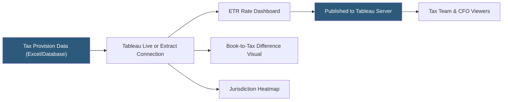

**Category:** Business Intelligence & Tax Analytics
**Difficulty:** Intermediate
**Reading time:** 6 min read

---

Tableau is used in corporate tax departments to visualize tax provision data, track effective tax rates across jurisdictions, and analyze book-to-tax differences. Tax-specific dashboards built in Tableau help tax teams move from spreadsheet-based reporting to interactive, auditable analytics that integrate with financial close processes.

- **Effective tax rate (ETR)** — Ratio of income tax expense to pre-tax book income, visualized as a trend line or waterfall
- **Jurisdiction mapping** — Linking tax data to geographic regions for multi-country tax analysis
- **Book-to-tax bridge** — Visualization showing permanent and temporary differences between book and taxable income
- **Tax provision schedule** — The structured dataset capturing current and deferred tax components by entity
- **Deferred tax asset/liability** — Future tax effects of temporary differences tracked over periods
- **Blended state rate** — Composite state income tax rate calculated from apportionment data
- **Waterfall chart** — Chart type showing contribution of each component to total ETR movement
- **Parameter control** — Tableau feature allowing users to switch between scenarios (statutory rate, projected ETR)

Tax analytics in Tableau typically starts with data extracted from a tax provision tool (OneSource, CorpTax, Longview) or from spreadsheet models exported to a structured format. The data model includes entities, jurisdictions, accounting periods, and line-item tax amounts for current and deferred components.

ETR trend dashboards plot the consolidated effective tax rate over rolling quarters or years, with drill-down capability to show which jurisdictions or book-to-tax items are driving rate movements. Waterfall charts are particularly effective for ETR variance analysis: each bar represents a rate driver (domestic rate, foreign rate differential, valuation allowance changes, discrete items) adding or subtracting from the prior period's ETR.

Book-to-tax bridges use horizontal bar charts or Gantt-style visualizations to show permanent differences (non-deductible expenses, tax-exempt income) and temporary differences (depreciation timing, stock compensation, revenue recognition) with their tax-effected amounts.

Jurisdiction heatmaps overlay deferred tax balances or current tax payments onto geographic maps, enabling quick identification of high-tax-cost regions or entities with significant deferred tax positions that may require valuation allowances.

Tableau parameters enable scenario modeling — for example, a slider allowing the user to change the assumed statutory rate to simulate legislative changes and instantly see the projected ETR impact across all jurisdictions.

- Visualizing ETR waterfall analysis for quarterly earnings calls
- Tracking deferred tax asset/liability trends by legal entity
- Mapping current tax payments across global jurisdictions
- Monitoring book-to-tax difference schedules during year-end close
- Scenario modeling for tax reform impact on the consolidated ETR

| Advantage | Disadvantage |
|-----------|--------------|
| Interactive drill-down replaces static tax provision spreadsheets | Tax data integration requires cleaning and normalizing provision tool exports |
| Visual ETR bridges communicate complex tax drivers to non-tax audiences | Tax-specific calculations (M adjustments, NOL tracking) require custom formulas |
| Scenario parameters enable rapid what-if analysis | Tableau does not natively enforce SOX-compliant audit trails |
| Centralized publishing ensures consistent reporting across reviewers | Large consolidated datasets may require extract optimization for performance |

- [Tableau Financial Analytics](tableau-financial-analytics.md)
- [Effective Tax Rate (ETR) Analytics](effective-tax-rate-etr-analytics.md)
- [Tax Dashboard Visualization](tax-dashboard-visualization.md)

---
*Part of the [Business Intelligence & Tax Analytics](index.md) category · [Back to Master Index](../../index.md)*
