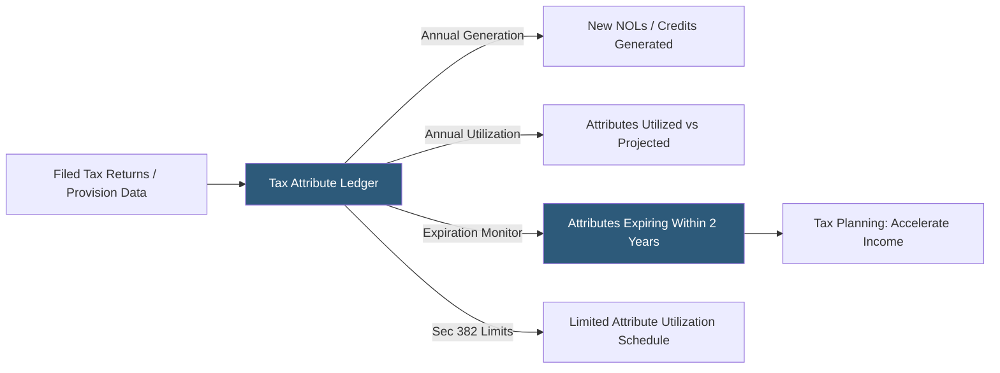

**Category:** Business Intelligence & Tax Analytics
**Difficulty:** Intermediate
**Reading time:** 6 min read

---

Tax attribute tracking maintains accurate records of net operating losses (NOLs), tax credit carryforwards, capital loss carryforwards, and other tax benefits that can offset future tax liability. Systematic tracking prevents expiration of valuable attributes, supports valuation allowance assessment, and informs tax planning to maximize attribute utilization.

- **Tax attribute** — A balance that reduces or defers future tax liability: NOLs, credits, basis differences, and loss carryforwards
- **Carryforward period** — The number of years an attribute may be carried forward to offset future income or tax
- **Section 382 limitation** — Annual limitation on NOL utilization following an ownership change of more than 50% within three years
- **Valuation allowance** — Reserve against deferred tax assets when realization is not more likely than not under ASC 740
- **Attribute expiration** — The date after which an unused attribute can no longer be utilized, creating a permanent loss
- **SRLY (Separate Return Limitation Year)** — Rule restricting use of pre-consolidation losses within a consolidated return group
- **Utilization modeling** — Projecting how attributes will be consumed against future taxable income under current forecasts
- **Dual-basis tracking** — Maintaining both federal and state attribute balances separately, as states may have different carryforward rules

Tax attribute tracking maintains a rolling ledger for each attribute type, entity, and jurisdiction. Federal NOL tracking records the year each NOL was generated, the initial amount, amounts utilized in each subsequent year, remaining balance, and expiration date. Pre-2018 NOLs expire after 20 years; post-Tax Cuts and Jobs Act NOLs carry forward indefinitely but are limited to 80% of taxable income annually.

Section 382 limitations are recorded when an ownership change is detected — typically through monitoring equity transactions and applying the value-times-rate calculation. The annual Section 382 limitation caps the amount of pre-change NOL that can be utilized each year, which the tracking system applies to the utilization schedule going forward.

Credit carryforward tracking applies the same structure: R&D credits generated, utilized each year (in priority order per general business credit rules), and remaining balance with 20-year expiration. State credit tracking runs in parallel with state-specific carryforward periods and utilization rules.

Valuation allowance assessment is supported by the attribute tracking system's utilization projections: projecting forward 12 to 24 quarters of forecasted taxable income against the attribute balance, the system assesses whether sufficient positive evidence exists to conclude that realization is more likely than not. Attributes with projected utilization dates beyond the forecast horizon trigger valuation allowance considerations.

SRLY tracking identifies pre-consolidation attributes of newly acquired entities, applying the separate return limitation year rules that restrict use of those attributes against consolidated group income.

- Monitoring federal NOL carryforward balances before the 80% annual limitation erodes future value
- Tracking Section 382 limitations for acquired companies' pre-change tax attributes
- Identifying R&D credit carryforwards approaching the 20-year expiration limit
- Supporting valuation allowance analysis by projecting attribute utilization against income forecasts
- Reconciling state NOL balances to federal NOL balances across 30+ filing states

| Advantage | Disadvantage |
|-----------|--------------|
| Systematic tracking prevents inadvertent attribute expiration and permanent tax losses | Attribute ledger must be updated annually from filed returns, creating data entry requirements |
| Section 382 limitation schedules prevent return errors and IRS assessments | Ownership change monitoring requires coordination with treasury and M&A teams |
| Valuation allowance projections provide ASC 740 support with less manual spreadsheet work | SRLY analysis for consolidated groups requires legal entity ownership history tracking |
| Dual federal/state tracking ensures state differences are captured in provision | Attribute tracking across 100+ entities and 40+ states requires significant system investment |

- [NOL (Net Operating Loss) Tracking](nol-net-operating-loss-tracking.md)
- [Investment Tax Credit Tracking](investment-tax-credit-tracking.md)
- [R&D Tax Credit Calculation](rd-tax-credit-calculation.md)

---
*Part of the [Business Intelligence & Tax Analytics](index.md) category · [Back to Master Index](../../index.md)*
