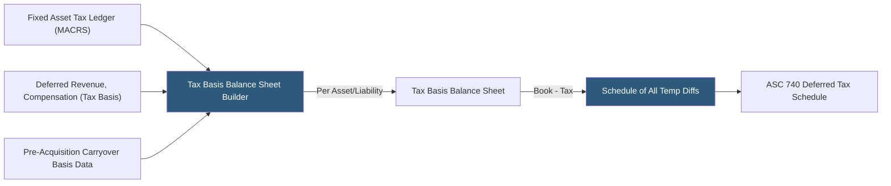

**Category:** Business Intelligence & Tax Analytics
**Difficulty:** Advanced
**Reading time:** 6 min read

---

A tax basis balance sheet presents each asset and liability at its tax carrying value rather than its GAAP book value. It is the foundation for computing temporary differences, measuring inside basis in subsidiaries, determining gain or loss on asset dispositions, and calculating liquidating distributions. Analytics tools derive the tax basis balance sheet from trial balance data, tax return schedules, and transaction records.

- **Tax basis** — The amount attributable to an asset or liability for tax purposes, typically its cost minus tax depreciation taken
- **Inside basis** — The tax basis of individual assets and liabilities within a corporate entity
- **Outside basis** — A shareholder's tax basis in the stock of the entity (often differs from inside basis in subsidiaries)
- **Built-in gain (BIG)** — Excess of fair market value over tax basis at the time of an S corporation election or Section 338 election
- **MACRS tax book value** — A fixed asset's adjusted tax basis computed as cost minus accumulated MACRS depreciation
- **Deferred tax basis** — The tax cost of deferred revenue or deferred compensation liabilities where the deduction was already taken
- **Carryover basis** — In a tax-free reorganization, the target's asset bases carry over to the acquirer
- **Step-up basis** — In a taxable acquisition, the target's asset bases are stepped up to fair value, eliminating inside BIG

The tax basis balance sheet is constructed by aggregating the tax carrying value of each material balance sheet component. For fixed assets, this means accumulating MACRS depreciation on each asset from the asset register's tax depreciation schedules. The tax net book value equals cost minus accumulated MACRS (including bonus depreciation), which often differs substantially from GAAP book value.

Inventory basis may differ from GAAP: LIFO reserves create a book-tax difference in inventory carrying value. Intangible assets amortize over 15 years under Section 197 for tax purposes, regardless of GAAP useful life. Goodwill amortizes over 15 years for tax but is no longer amortized for GAAP under ASC 350 (unless using GAAP indefinite-life exception), creating a growing temporary difference.

Liabilities are analyzed for tax basis: a deferred revenue liability has zero tax basis in most cases because tax recognized the income when received, meaning the liability will be extinguished (returned to revenue) for book without any future tax deduction. This creates a DTA. Accrued bonuses not yet deductible under the 2.5-month rule have a zero tax basis until paid.

Comparing the tax basis balance sheet to the GAAP balance sheet column by column generates the complete schedule of temporary differences, which forms the basis for computing the ending DTA/DTL position.

Inside basis analysis is required for consolidated subsidiaries: the parent's tax basis in subsidiary stock may differ from the net assets of the subsidiary on a tax basis, creating an outside basis difference that generates a DTL (if outside basis > inside net assets) or DTA (if outside basis < inside net assets).

- Computing the complete schedule of temporary differences for ASC 740 deferred tax calculation
- Determining taxable gain on sale of a subsidiary by comparing proceeds to outside basis
- Identifying built-in gains on an S corporation election for the 5-year recognition period
- Analyzing the inside basis of acquired assets to determine whether a taxable or tax-free structure was used
- Supporting transfer pricing arm's-length analysis with asset tax basis data for QBAI calculations

| Advantage | Disadvantage |
|-----------|--------------|
| Tax basis balance sheet provides a complete, systematic source for all temporary differences | Constructing the tax basis balance sheet requires detailed tax depreciation records by asset |
| Inside basis analysis prevents errors in gain calculation on subsidiary dispositions | Outside basis differences in subsidiaries require separate analysis and are often omitted |
| Built-in gain monitoring protects against unexpected BIG tax from premature S corp elections | Carryover basis in reorganizations requires accessing historical acquisition records |
| LIFO reserve and inventory basis analysis prevents missed temporary differences | Intangible asset basis tracking across multiple acquisitions with different structures is complex |

- [Book-to-Tax Differences](book-to-tax-differences.md)
- [Permanent vs. Temporary Differences](permanent-vs-temporary-differences.md)
- [Schedule M Adjustments](schedule-m-adjustments.md)

---
*Part of the [Business Intelligence & Tax Analytics](index.md) category · [Back to Master Index](../../index.md)*
