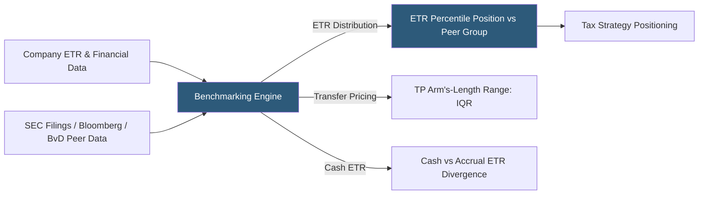

**Category:** Business Intelligence & Tax Analytics
**Difficulty:** Intermediate
**Reading time:** 6 min read

---

Tax benchmarking analytics compares an organization's tax metrics against industry peers, geographic competitors, and historical performance to assess whether current tax positions are competitive, identify outliers that may attract regulatory scrutiny, and quantify the opportunity or risk relative to the peer group.

- **Peer group** — A set of comparable companies (same industry, similar revenue size, similar geographic footprint) used for benchmarking
- **ETR peer comparison** — Comparing the consolidated effective tax rate against the median and distribution of peer ETRs
- **Cash ETR benchmark** — Comparing actual cash tax payments as a percent of pre-tax income to peers, revealing cash vs accrual differences
- **Industry average ETR** — The median or mean ETR for a specific industry sector, available from academic research and tax publications
- **Transfer pricing benchmark** — Arm's-length profitability comparison used to test whether intercompany pricing is within the acceptable range
- **Comps database** — Third-party databases (BvD Bureau van Dijk, Refinitiv, Bloomberg) containing financial data for benchmarking
- **Interquartile range (IQR)** — The range between the 25th and 75th percentile used in transfer pricing arm's-length range
- **Country-by-Country Report (CbCR)** — BEPS-required filing disclosing revenue, profit, tax, and employees by country used by tax authorities for risk assessment

Tax benchmarking analytics for ETR comparison aggregates peer companies' reported tax provision data from public financial statements (10-K filings for US public companies, country-specific statutory accounts for foreign peers). The aggregated dataset is used to compute the peer group distribution — median, 25th percentile, 75th percentile — for the consolidated effective tax rate.

Positioning the company's ETR within the peer distribution is the core output: a company at the 15th percentile (low ETR relative to peers) may face increased scrutiny from tax authorities and investor questions about tax risk. A company at the 85th percentile (high ETR) may be over-paying tax relative to peers, suggesting planning opportunities.

Transfer pricing benchmarking uses commercial databases (BvD Bureau van Dijk ORBIS, Refinitiv, TP Catalyst) to identify comparable uncontrolled transactions for each intercompany arrangement. A distribution test compares the intercompany profit margin or price to the arm's-length range defined by the comparable company results, determining whether the tested party's results fall within the interquartile range.

Country-by-country report analytics aggregate the BEPS CbCR disclosures filed by peers (publicly disclosed in some countries) to benchmark profit allocation across jurisdictions, identifying peers' effective strategies and potential tax authority risk signals.

Cash ETR benchmarking compares actual tax payments to the accounting provision: a company with a significantly lower cash ETR than reported ETR signals large deferred tax liabilities (accelerated deductions) or successful tax planning generating timing differences.

- Quantifying where the company's ETR falls in the peer distribution for investor relations Q&A preparation
- Testing whether a transfer pricing arrangement produces results within the arm's-length range before audit
- Benchmarking the company's CbCR profit allocation against public peer disclosures
- Identifying industry sectors with notably lower ETRs to understand planning approaches used by peers
- Presenting the ETR competitive positioning to the board as part of the annual tax strategy review

| Advantage | Disadvantage |
|-----------|--------------|
| Peer comparison contextualizes the ETR for CFO and investor audiences | Peer group selection is subjective and can materially affect conclusions |
| Transfer pricing benchmark studies support positions under tax authority scrutiny | Commercial TP databases require licenses and industry expertise to use correctly |
| Below-peer ETR early warning reduces regulatory scrutiny risk | Publicly available CbCR data is limited; not all jurisdictions require public disclosure |
| Cash vs accrual ETR comparison reveals permanent planning advantages | ETR comparability requires adjusting for discrete items and non-recurring provisions |

- [Tax KPI Tracking](tax-kpi-tracking.md)
- [Effective Tax Rate (ETR) Analytics](effective-tax-rate-etr-analytics.md)
- [Industry Tax Analytics](industry-tax-analytics.md)

---
*Part of the [Business Intelligence & Tax Analytics](index.md) category · [Back to Master Index](../../index.md)*
