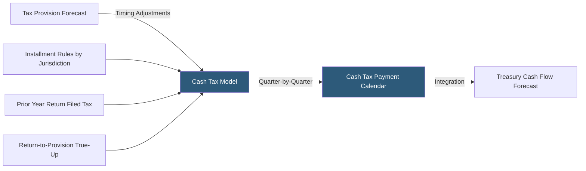

**Category:** Business Intelligence & Tax Analytics
**Difficulty:** Advanced
**Reading time:** 7 min read

---

Tax cash flow modeling projects the actual timing and amount of tax payments to and from tax authorities, which differs materially from the tax provision recognized under ASC 740. Accurate cash tax models are essential for treasury liquidity planning, merger structuring, and cash repatriation strategies in multinational corporations.

- **Cash taxes paid** — Actual payments made to tax authorities, including estimated tax installments and extensions
- **Annualized income method** — Installment calculation method based on annualizing actual year-to-date income each quarter
- **Prior-year safe harbor** — Installment method paying 100% (or 110% for large corporations) of prior year tax to avoid penalties
- **Extension payment** — Tax payment made at the extension filing date before the return is completed
- **Return-to-provision adjustment** — Difference between the tax expense accrued and the tax return amount, creating a true-up payment or refund
- **Tax refund timing** — Period in which overpayments are received as refunds, affected by jurisdiction processing timelines
- **Repatriation modeling** — Cash flow impact of dividends from foreign subsidiaries triggering withholding taxes
- **NOL refund claims** — Carryback refunds representing cash inflows from prior-period loss utilization

Cash tax models start with the tax provision forecast (annual current tax expense by entity) and convert it to a period-by-period cash payment schedule. The conversion requires applying jurisdiction-specific installment rules: US corporations make four equal estimated tax installments in April, June, September, and December based on the lesser of the annualized income method or prior-year safe harbor.

For each jurisdiction, the model projects: (1) estimated tax installments during the year based on the forecasted current provision, (2) the extension payment (if applicable) at the extended filing deadline, (3) the return payment or refund when the final return is filed, and (4) any audit settlements or amended return impacts.

Return-to-provision adjustments are a critical cash flow component. When the finalized tax return differs from the accrued provision, the difference creates either an additional payment (if more tax is owed) or a refund (if tax was overpaid). The model tracks the expected timing of these true-ups based on typical return filing schedules.

Multinational models add foreign withholding taxes on intercompany dividends and royalties, treaty-reduced rates, and foreign tax credit utilization to project the net cash outflow from repatriation strategies. NOL carryback refund claims create cash inflows modeled against the statutory processing timeline for each jurisdiction.

The output is a monthly or quarterly cash tax payment calendar that integrates with the treasury's cash flow forecast, enabling accurate working capital and liquidity planning.

- Providing treasury with a 12-month rolling cash tax payment forecast for liquidity management
- Modeling cash tax timing for an acquisition to assess target company's cash tax profile
- Optimizing estimated tax installment strategy to minimize overpayment while avoiding penalties
- Projecting cash repatriation costs for dividend declarations from foreign subsidiaries
- Forecasting the timing of NOL refund claims from carryback elections

| Advantage | Disadvantage |
|-----------|--------------|
| Accurate cash tax forecasts reduce treasury surprises from unexpected tax payments | Installment rules vary by jurisdiction, requiring detailed jurisdiction-specific logic |
| Integration with treasury model improves enterprise cash flow forecast accuracy | Return-to-provision timing is uncertain until returns are filed, reducing precision |
| Repatriation modeling enables informed dividend planning decisions | Foreign withholding tax treaties require current legal review to reflect correct rates |
| NOL carryback modeling identifies timing of cash refund inflows | Audit settlements are inherently unpredictable, limiting long-range forecast accuracy |

- [Tax Forecasting Platforms](tax-forecasting-platforms.md)
- [Tax Scenario Planning](tax-scenario-planning.md)
- [Effective Tax Rate (ETR) Analytics](effective-tax-rate-etr-analytics.md)

---
*Part of the [Business Intelligence & Tax Analytics](index.md) category · [Back to Master Index](../../index.md)*
