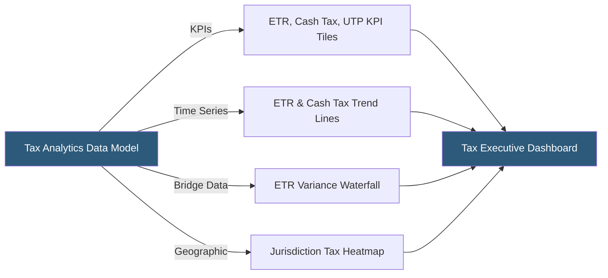

**Category:** Business Intelligence & Tax Analytics
**Difficulty:** Beginner
**Reading time:** 5 min read

---

Tax dashboard visualization translates complex tax provision, compliance, and planning data into intuitive visual displays that communicate key metrics to tax professionals, finance leadership, and board members. Effective tax dashboards use appropriate chart types, clear KPI tiles, and drill-down navigation to make tax data accessible without requiring tax expertise.

- **KPI tile** — A prominent single-number display for a critical tax metric (Current ETR, Cash Taxes Paid, UTP Reserve Balance)
- **ETR trend chart** — A line or bar chart plotting the effective tax rate over multiple periods for trend identification
- **Waterfall chart** — A chart type ideal for ETR bridge analysis showing step-by-step contribution of each rate driver
- **Heatmap** — A geographic or matrix visualization using color intensity to show tax burden by jurisdiction
- **Drill-down** — Navigation from a summary metric to the underlying detail data supporting that metric
- **Traffic light** — Red/yellow/green color coding on KPI tiles indicating performance against threshold targets
- **Variance indicator** — An arrow or percentage showing the change from prior period with conditional formatting
- **Annotation** — Text overlay on a chart flagging an unusual data point with explanatory context

Tax dashboards are designed around the audience's questions. A CFO dashboard answers "What is our ETR and how does it compare to plan and prior year?" with large KPI tiles and trend charts. A tax team dashboard answers "What are the significant provision items and where are the risks?" with detail tables, drill-downs, and exception indicators.

ETR trend charts typically plot 6–8 quarters of consolidated ETR as a bar or line, with reference lines showing the statutory rate, prior year ETR, and guidance midpoint. A second series shows the ETR excluding discrete items, enabling comparison on a recurring basis.

Waterfall charts are the most impactful visualization for ETR bridge analysis: the first bar shows the prior period ETR, each subsequent bar shows the contribution of one rate driver (foreign rate differential, R&D credits, valuation allowance, discrete items), and the final bar shows the current period ETR. The chart instantly communicates the "story" of ETR movement without requiring users to read tables.

Geographic heatmaps overlay cash tax payments or ETR by country on a world map, using color intensity (light = low tax burden, dark = high) to show concentration. This is particularly effective for showing the global tax footprint to board members or investor relations teams.

Drill-down navigation connects summary KPI tiles to detail tables: clicking the $45M UTP Reserve KPI opens a table showing each uncertain position, its jurisdiction, reserve amount, likelihood estimate, and aging.

Traffic light coding on KPI tiles provides immediate attention direction: ETR within 0.5% of plan shows green; 0.5–2% deviation shows yellow; over 2% deviation shows red, indicating escalation needed.

- Building a board-level tax dashboard showing ETR, cash taxes paid, and UTP reserve for quarterly review
- Creating an operational close dashboard for tax team showing provision completeness status by entity
- Visualizing the global tax footprint on a jurisdiction heatmap for investor relations presentations
- Designing a tax risk dashboard showing the UTP register sorted by risk score and aging
- Building an ETR bridge waterfall for earnings call preparation showing quarter-over-quarter rate drivers

| Advantage | Disadvantage |
|-----------|--------------|
| Visual dashboards communicate tax data to non-tax audiences in seconds | Dashboard design requires understanding of both tax concepts and data visualization best practices |
| KPI tiles with traffic lights enable immediate exception identification | Too many KPI tiles create cognitive overload; dashboards require discipline in metric selection |
| Waterfall charts communicate ETR movement more clearly than any table format | Drill-down design requires careful UX planning to maintain context during navigation |
| Geographic heatmaps make global tax footprint tangible for non-tax stakeholders | Geographic visualizations require geocoded jurisdiction data that may not be in the tax data model |

- [Tax KPI Tracking](tax-kpi-tracking.md)
- [Tableau Tax Analytics](tableau-tax-analytics.md)
- [Automated Tax Reporting](automated-tax-reporting.md)

---
*Part of the [Business Intelligence & Tax Analytics](index.md) category · [Back to Master Index](../../index.md)*
