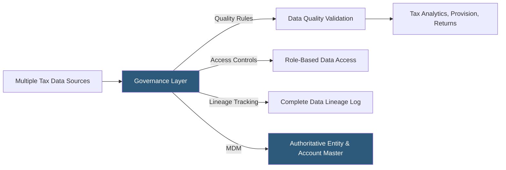

**Category:** Business Intelligence & Tax Analytics
**Difficulty:** Intermediate
**Reading time:** 6 min read

---

Tax data governance establishes the policies, standards, roles, and processes that ensure tax data is accurate, consistent, secure, and auditable across all systems and reports. Effective governance is critical for SOX compliance, audit defense, and maintaining a single source of truth across provision, compliance, and planning workstreams.

- **Data steward** — A designated individual responsible for the quality and integrity of a specific data domain (entity master, chart of accounts)
- **Data lineage** — The documented path from source transaction to final tax output, enabling reproducibility and audit defense
- **Data dictionary** — Authoritative definitions of each data element used in tax analytics, including calculation methodology
- **Master data management (MDM)** — Governance of reference data (legal entity list, jurisdiction codes, account hierarchies)
- **Access controls** — Role-based permissions ensuring each user accesses only authorized tax data
- **Change management** — Process for updating data definitions, models, or sources without breaking downstream reports
- **Data quality rules** — Automated validation checks that prevent incorrect data from reaching tax calculations
- **Audit trail** — Immutable log of all data modifications, user actions, and report generations for compliance evidence

Tax data governance begins with establishing data ownership: the tax technology team owns the tax data infrastructure, individual tax managers own data domains (provision data steward, credits data steward, apportionment data steward), and the data engineering team implements the technical controls.

Master data management for tax addresses the four most critical reference datasets: the legal entity list (defining entity names, EINs, jurisdictions, ownership percentages, and effective dates), the chart of accounts with tax mapping (mapping each GL account to its M adjustment category and provision schedule line), the jurisdiction master (country and state codes with applicable treaty rates and apportionment rules), and the period calendar (fiscal periods, tax year end dates, filing deadlines by jurisdiction).

Data quality rules are implemented as automated checks in the data pipeline: entity completeness (all entities in entity master appear in financial data), balance validation (all debits equal credits), intercompany elimination (intercompany payables equal receivables after elimination), and rate validation (effective tax rates within expected ranges).

Access controls apply role-based permissions: provision preparers see only their assigned entities, provision reviewers see all entities, external auditors receive read-only access to approved datasets, and tax authorities receive only the specifically requested information.

Change management for tax data governance requires documentation of any change to entity definitions, account mappings, or calculation methodologies, with the effective date clearly recorded so that historical reports can be reproduced consistently for prior periods.

- Establishing a governed entity master that serves as the single authoritative source for all tax workstreams
- Implementing data lineage tracking to support IRS Information Document Requests (IDRs)
- Setting up role-based access to protect sensitive transfer pricing data from unauthorized viewing
- Automating data quality alerts during close to catch ERP extraction errors before the provision runs
- Documenting calculation methodologies in the data dictionary to support SOX control documentation

| Advantage | Disadvantage |
|-----------|--------------|
| Governance reduces audit preparation time by providing documented lineage and controls | Establishing governance policies requires cross-functional cooperation and executive sponsorship |
| MDM eliminates entity name discrepancies that create reconciliation effort across workstreams | Strict change management slows the ability to make quick fixes during close crunch periods |
| Access controls protect sensitive tax positions from unauthorized disclosure | Data quality rules require initial tuning to distinguish genuine errors from expected exceptions |
| Audit trail supports SOX tax provision controls documentation | Governance infrastructure requires dedicated tax technology staff to maintain |

- [Tax Data Warehouse Platforms](tax-data-warehouse-platforms.md)
- [Tax Master Data Management](tax-master-data-management.md)
- [Automated Tax Reporting](automated-tax-reporting.md)

---
*Part of the [Business Intelligence & Tax Analytics](index.md) category · [Back to Master Index](../../index.md)*
