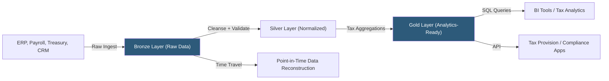

**Category:** Business Intelligence & Tax Analytics
**Difficulty:** Advanced
**Reading time:** 6 min read

---

A tax data lake stores raw, unstructured, and semi-structured financial and operational data at scale before transformation, enabling tax teams to access source-level transaction data without pre-defining schema. Modern lakehouse architectures combine the storage flexibility of data lakes with ACID transactions and SQL query capabilities for tax analytics.

- **Data lake** — A storage repository holding raw data in its native format (CSV, JSON, Parquet, XML) without requiring upfront schema definition
- **Lakehouse** — A modern architecture combining data lake storage with data warehouse ACID transactions and SQL (Delta Lake, Apache Iceberg)
- **Bronze/Silver/Gold layers** — Medallion architecture: Bronze = raw ingestion, Silver = cleansed/normalized, Gold = aggregated/analytics-ready
- **Delta Lake** — Open-source storage layer by Databricks providing ACID transactions, schema enforcement, and time travel on cloud storage
- **Apache Parquet** — Columnar storage format used in tax data lakes for efficient compression and query performance
- **Schema-on-read** — Reading data and applying schema at query time, enabling storage of diverse source formats
- **Data catalog** — Metadata inventory tracking available datasets, schemas, lineage, and ownership in the tax lake
- **Time travel** — Ability to query the state of the data lake at a past point in time (useful for reconstructing historical provision data)

Tax data lake architecture uses the medallion pattern to organize data through three quality tiers. The Bronze layer ingests raw data from source systems without transformation — ERP extracts arrive as CSV files, payroll as JSON API responses, and tax return data as XML. Data is stored in Parquet or Delta Lake format with minimal processing, preserving the original data for reprocessing if transformation logic changes.

The Silver layer applies cleansing: removing duplicates, standardizing entity names and account codes, validating data types, and rejecting records failing quality rules. Silver layer data is normalized into consistent schemas: a transaction fact table with entity, date, account, amount, and source system columns; a payroll fact table with employee, state, amount, and activity code.

The Gold layer applies tax-specific aggregations and calculations: trial balance summaries by period and entity, M adjustment schedules computed from account-level differences, apportionment factors by state, and GILTI tested income summaries by CFC. Gold layer data feeds BI tools and tax applications directly.

Delta Lake features enable tax-specific capabilities: ACID transactions prevent partial loads from corrupting the dataset during close-period ingest. Schema evolution allows adding new columns when source systems change without breaking existing queries. Time travel enables querying the lake as of any prior point, supporting audit requests for "what did the provision data look like when we filed the return on March 15?"

Apache Spark running on Databricks, Synapse Analytics, or Amazon EMR processes large-scale tax computations (millions of transactions) that would overwhelm traditional warehouse approaches.

- Storing three years of transaction-level ERP data for state apportionment factor calculation and audit support
- Processing payroll files from 20 countries to identify R&D credit QREs globally
- Time-travel reconstruction of the data as of a filing date to support IRS exam of a prior-year return
- Running machine learning anomaly detection on invoice-level expense data to identify unusual M adjustment items
- Integrating unstructured data (contracts, tax notices) alongside structured GL data for comprehensive tax analysis

| Advantage | Disadvantage |
|-----------|--------------|
| Schema-on-read accommodates diverse source formats without upfront modeling | Without governance, data lakes become "data swamps" with undocumented, unusable datasets |
| Time travel provides audit-ready historical data reconstruction capability | Bronze layer contains raw, unvalidated data that is easy to misuse without Silver processing |
| Lakehouse ACID transactions prevent data corruption during concurrent loads | Spark-based processing requires data engineering skills to configure and maintain |
| Petabyte-scale storage enables retaining full transaction history indefinitely | Query performance on large unindexed datasets requires optimization skills |

- [Tax Data Warehouse Platforms](tax-data-warehouse-platforms.md)
- [Tax Data Governance](tax-data-governance.md)
- [Tax Master Data Management](tax-master-data-management.md)

---
*Part of the [Business Intelligence & Tax Analytics](index.md) category · [Back to Master Index](../../index.md)*
