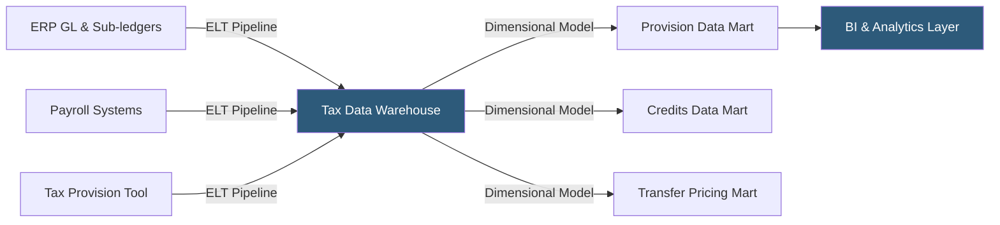

**Category:** Business Intelligence & Tax Analytics
**Difficulty:** Advanced
**Reading time:** 7 min read

---

Tax data warehouse platforms centralize financial and operational data from ERP systems, tax provision tools, and payroll platforms into a structured analytical environment optimized for tax computation, reporting, and analytics. A purpose-built tax data warehouse reduces data reconciliation effort, enables real-time analytics, and provides a single source of truth for all tax reporting workstreams.

- **Tax data model** — A dimensional schema designed for tax analytics: entities, jurisdictions, periods, accounts, transaction types
- **Data lineage** — The traceable path from source system transactions to final tax figures used in returns
- **Conformed dimensions** — Shared dimension tables (entity, period, jurisdiction) reused across all tax data marts
- **Tax data mart** — A subject-specific subset of the tax data warehouse (provision mart, credits mart, transfer pricing mart)
- **ELT architecture** — Extract-Load-Transform pattern using the warehouse as the transformation engine (vs ETL)
- **Incremental load** — Refreshing only changed records since the last load, enabling frequent updates without full reload
- **Data quality rules** — Validation checks ensuring balance sheet ties, intercompany eliminations match, and entity lists are complete
- **Snowflake/BigQuery/Databricks** — Cloud data warehouses commonly used as the foundation for modern tax data platforms

Tax data warehouse architecture begins with defining the tax-optimized dimensional model. The core fact tables store trial balance amounts (by entity, account, period, scenario), transaction details (by entity, date, vendor/customer, amount), and tax-specific items (by provision schedule, difference type, DTA/DTL category). Dimension tables for entities (with legal hierarchy), accounts (with tax mapping), periods (with fiscal and tax year calendars), and jurisdictions (with rate schedules) are shared across all fact tables.

ELT pipelines extract data from source systems nightly or intraday. For ERP systems (SAP, Oracle Fusion, NetSuite), extracts pull trial balance summaries or transaction-level detail depending on the granularity required. Payroll systems feed wages by state and employee for apportionment and R&D credit calculations. Provision tool exports bring pre-calculated provision schedules that are loaded with data lineage tracking.

Data quality rules validate completeness: all entities in the entity master appear in the financial data, intercompany eliminations balance to zero, and chart of accounts mappings cover 100% of account codes. Failing records are quarantined and reported to the tax team before the data is used in reporting.

The tax data model supports both the analytical BI layer and direct computation: complex SQL or dbt transformations compute apportionment factors, GILTI calculations, and M adjustment schedules in the warehouse itself, with results materialized as tables available to BI tools.

Cloud platforms like Snowflake (with its separation of compute and storage) and BigQuery (with its serverless auto-scaling) are popular for tax data warehouses because they handle variable query loads efficiently — light during normal periods, heavy during close.

- Centralizing 10 disparate data sources (2 ERPs, 4 state filings, payroll, treasury) into one analytical environment
- Enabling real-time provision analytics by loading GL data as of each business day close
- Building a single entity master dimension shared across provision, credits, apportionment, and transfer pricing workstreams
- Providing data lineage from source transaction to return line item for audit defense
- Replacing 50 separate Excel workbooks with governed dbt models calculating M adjustments in the warehouse

| Advantage | Disadvantage |
|-----------|--------------|
| Single source of truth eliminates reconciliation between siloed data sources | Building a purpose-built tax data warehouse requires significant upfront investment in data engineering |
| Cloud warehouse scalability handles close-period query volume without hardware planning | ELT pipeline maintenance is ongoing as source systems change with ERP upgrades |
| Data lineage enables audit-ready documentation from transaction to return | Data quality issues in source systems are amplified and must be addressed at source, not just masked |
| Dimensional model supports both provision computation and BI analytics from same data | Specialized tax domain knowledge required to design the tax-specific data model correctly |

- [Tax Data Lake Architecture](tax-data-lake-architecture.md)
- [Tax Data Governance](tax-data-governance.md)
- [Tableau Financial Analytics](tableau-financial-analytics.md)

---
*Part of the [Business Intelligence & Tax Analytics](index.md) category · [Back to Master Index](../../index.md)*
