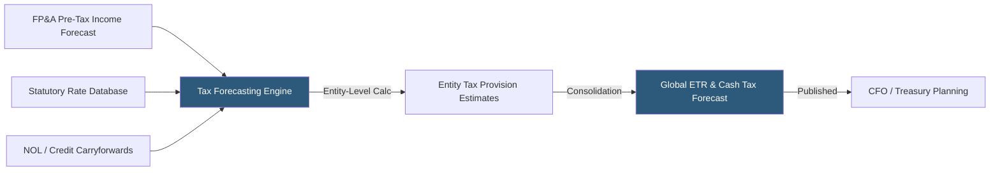

**Category:** Business Intelligence & Tax Analytics
**Difficulty:** Intermediate
**Reading time:** 6 min read

---

Tax forecasting platforms provide dedicated tools for projecting future tax liabilities, cash tax payments, and effective tax rates across multiple entities and jurisdictions. They integrate with financial planning systems to synchronize pre-tax income forecasts and use historical data to model permanent and temporary differences under various scenarios.

- **Cash tax forecast** — Projection of actual tax payments in each period, accounting for estimated tax installments and extension timing
- **Provision forecast** — Forward-looking ASC 740 tax provision estimate based on projected pre-tax income
- **Rate scenario modeling** — Simulation of tax liability under different statutory rate assumptions
- **Estimated tax installments** — Quarterly prepayments required under tax law to avoid underpayment penalties
- **Tax attribute utilization** — Modeling how NOLs, credits, and other attributes reduce forecasted tax expense
- **Multijurisdiction rollup** — Consolidating entity-level tax forecasts into a consolidated global projection
- **Variance analysis** — Comparing forecasted tax to actual or revised estimates explaining differences
- **Integrated planning** — Linking tax forecasts to enterprise FP&A systems for consistent financial projections

Tax forecasting platforms ingest pre-tax income projections from the enterprise financial plan (via API or flat file integration), apply jurisdiction-specific statutory rates, add estimated book-to-tax differences based on historical patterns and planned transactions, and compute a period-by-period tax provision forecast for each legal entity.

The forecasting engine maintains a database of current statutory rates by jurisdiction and models blended effective rates incorporating state apportionment, treaty rates, and controlled foreign corporation inclusions. For entities with significant tax attributes (NOL carryforwards, R&D credits, foreign tax credits), the model applies utilization logic in priority order to reduce the projected tax expense.

Cash tax forecasts translate the provision estimate into actual payment timing by applying estimated tax installment rules — the annualized income method or prior-year safe harbor — and projecting extension payment timing, true-up payments, and refund timing from overpayments.

Scenario capabilities run the complete forecast model simultaneously across multiple rate scenarios (current law, proposed legislation, +/- 5% pre-tax income sensitivity) and present results in comparative dashboards showing ETR sensitivity across scenarios.

Leading platforms in this space include OneSource Tax Provision (now ONESOURCE), Corptax, LONGVIEW Tax, and Oracle Tax Reporting Cloud, as well as FP&A platforms like Anaplan and Adaptive Insights configured for tax use cases.

- Providing treasury with reliable quarterly cash tax payment forecasts for liquidity planning
- Generating earnings call ETR guidance ranges with sensitivity analysis
- Modeling the cash tax impact of proposed M&A transactions on the consolidated tax profile
- Forecasting deferred tax asset realization to inform valuation allowance assessments
- Projecting tax attribute utilization to optimize estimated tax installment strategies

| Advantage | Disadvantage |
|-----------|--------------|
| Integrated rate databases reduce manual statutory rate research | Forecast accuracy depends heavily on quality of pre-tax income inputs |
| Scenario modeling quantifies tax exposure to legislative changes | Multi-jurisdictional models are complex to maintain as entities change |
| Cash tax timing logic reduces treasury surprises at payment dates | Dedicated platforms have significant licensing cost beyond general BI tools |
| Attribution of forecast variance to specific drivers enables targeted review | Integration with ERP and FP&A systems requires ongoing maintenance |

- [Anaplan Tax Planning](anaplan-tax-planning.md)
- [Tax Scenario Planning](tax-scenario-planning.md)
- [Effective Tax Rate (ETR) Analytics](effective-tax-rate-etr-analytics.md)

---
*Part of the [Business Intelligence & Tax Analytics](index.md) category · [Back to Master Index](../../index.md)*
