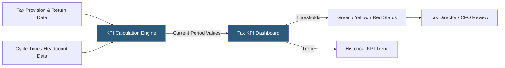

**Category:** Business Intelligence & Tax Analytics
**Difficulty:** Beginner
**Reading time:** 5 min read

---

Tax KPI tracking monitors the key performance indicators that measure a tax department's performance, risk profile, and operational efficiency. Defined KPIs enable tax leadership to demonstrate value, identify emerging issues early, and align tax strategy with broader corporate objectives.

- **Effective tax rate (ETR)** — Ratio of income tax expense to pre-tax book income; the primary financial KPI for tax
- **Cash ETR** — Cash taxes paid divided by pre-tax book income; reflects actual cash tax burden vs accounting rate
- **Tax provision cycle time** — Days required to complete the quarterly or annual tax provision from close trigger to approval
- **Return filing accuracy** — Percentage of returns filed without material corrections or amended returns
- **Audit adjustment rate** — Tax adjustments assessed by authorities as a percentage of filed tax liability
- **UTP reserve adequacy** — Ratio of current UTP reserve to estimated exposure, assessing reserve sufficiency
- **Tax team headcount per $B revenue** — Operational efficiency ratio benchmarked against industry peers
- **Credit utilization rate** — Percentage of available tax credits actually applied against tax liability in the year

Tax KPI frameworks categorize metrics into financial performance (ETR, cash ETR, tax burden as % of revenue), risk management (UTP reserve balance, audit adjustment rate, uncertain position count), and operational efficiency (provision cycle time, return filing on-time rate, FTE per $B revenue).

Financial KPIs are computed from the tax provision and financial statement data. ETR is calculated quarterly and compared to plan (the beginning-of-year ETR guidance) and prior year. Cash ETR requires the cash flow statement's "taxes paid" figure divided by pre-tax income, providing a measure of actual cash burden separate from accounting accruals.

Risk KPIs track the UTP reserve balance trend over time (growing reserves signal increasing uncertain positions), the number of open tax examinations by jurisdiction, and the historical audit adjustment rate (how much tax authorities have assessed above filed amounts in closed exams). A rising audit adjustment rate may signal that positions need strengthening.

Operational KPIs measure tax department efficiency: provision cycle time is tracked from when the trial balance becomes available to when the provision is approved, with a target of 7–10 business days for most public companies. Return filing accuracy tracks whether returns are filed without subsequent corrections, and on-time filing rate measures compliance with all deadlines.

Benchmarking tax KPIs against industry peers requires publicly available data (SEC filings for ETR, KPMG/Deloitte/PwC tax benchmarking surveys for operational metrics), enabling the tax director to demonstrate performance relative to comparable organizations.

- Presenting quarterly ETR versus plan and guidance to the CFO with traffic light status
- Tracking provision cycle time improvement over four quarters to measure process efficiency gains
- Monitoring audit adjustment rate trend to identify whether exam risk is increasing
- Demonstrating credit utilization rate to show value created from tax attribute planning
- Benchmarking tax team headcount efficiency against industry averages in board presentations

| Advantage | Disadvantage |
|-----------|--------------|
| KPI dashboards demonstrate tax department value to CFO and board in business terms | KPI selection requires careful calibration to avoid incentivizing the wrong behaviors |
| Trend tracking identifies emerging issues before they become material problems | Benchmarking data is lagged and may not reflect current-year peer performance |
| Traffic light coding enables immediate exception identification and escalation | Audit adjustment rate KPI can penalize tax departments in high-scrutiny industries unfairly |
| Operational KPIs provide objective basis for resource allocation discussions | Provision cycle time reduction must be balanced against quality and accuracy |

- [Tax Dashboard Visualization](tax-dashboard-visualization.md)
- [Effective Tax Rate (ETR) Analytics](effective-tax-rate-etr-analytics.md)
- [Tax Benchmarking Analytics](tax-benchmarking-analytics.md)

---
*Part of the [Business Intelligence & Tax Analytics](index.md) category · [Back to Master Index](../../index.md)*
