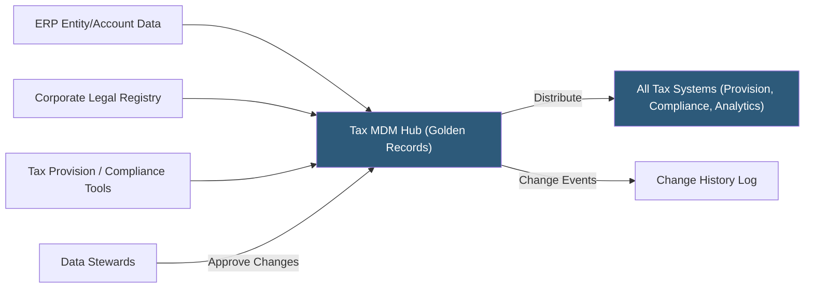

**Category:** Business Intelligence & Tax Analytics
**Difficulty:** Intermediate
**Reading time:** 6 min read

---

Tax master data management (MDM) maintains the authoritative reference datasets — legal entity registry, chart of accounts tax mappings, jurisdiction codes, and tax rates — that all tax workstreams depend on for accurate calculation and reporting. Inconsistent master data is the most common source of reconciliation failures between tax systems.

- **Legal entity registry** — Authoritative list of all entities with EINs, country registrations, ownership percentages, and effective dates
- **Chart of accounts (COA) tax mapping** — Mapping each GL account to its tax schedule line, M adjustment category, and provision schedule
- **Jurisdiction code master** — Standardized codes for all tax jurisdictions, with applicable rates, treaty rates, and filing requirements
- **Rate table** — Historical and current statutory tax rates by jurisdiction, effective from/to dates
- **Entity hierarchy** — Parent-child relationships defining the consolidation tree for consolidated returns and provision
- **Source of record** — The system of record designated as authoritative for each master data element
- **MDM hub** — A central repository maintaining master data and distributing it to all consuming systems
- **Golden record** — The single authoritative version of a master data entity, reconciling conflicting records from source systems

Tax MDM begins with identifying all master data entities required for tax operations and designating a source of record for each. The legal entity list's source of record is typically the corporate legal or treasury team's entity management system. The chart of accounts source of record is the ERP finance team. Tax rates are maintained by the tax technology team from primary sources (tax authority publications, Bloomberg Tax, Thomson Reuters Checkpoint).

The MDM hub aggregates master data from designated sources, applies standardization rules (consistent entity name formats, ISO jurisdiction codes, standardized account classification), and publishes a golden record to all consuming systems. When the ERP contains entity "ABC Holdings, Inc." and the provision tool contains "ABC Holdings Inc" (no comma), the MDM layer standardizes both to the canonical form.

Entity hierarchy maintenance requires capturing acquisitions, mergers, liquidations, and restructurings with effective dates. When a new entity is acquired, it must be added to the hierarchy before the close period in which it first appears in the consolidated return. The MDM system triggers workflows for new entity setup: EIN registration, state registration status, treaty country determination, and provision tool entity creation.

COA-to-tax mapping is maintained in a mapping table connecting each GL account code to its M-3 line (for federal provision), its state tax treatment, and its international classification (tested income, subpart F income, GILTI QBAI). Changes to the COA in the ERP trigger a mapping review workflow in the MDM system.

Tax rate tables are updated annually (or more frequently in jurisdictions with rate changes): federal rate (21%), state rates by jurisdiction (including surtaxes and credits reducing the statutory rate), and country treaty withholding rates.

- Maintaining a single entity list shared across provision, state compliance, and analytics tools to prevent entity count discrepancies
- Automating entity setup workflows when the legal team registers a new subsidiary
- Enforcing consistent jurisdiction codes across state apportionment, provision, and return systems
- Distributing updated state tax rate tables to all systems immediately after legislation is enacted
- Reconciling entity name differences between ERP and tax provision tool through MDM standardization

| Advantage | Disadvantage |
|-----------|--------------|
| Single authoritative master eliminates entity count discrepancies between systems | MDM hub setup requires integration work with each consuming system |
| Effective-dated records enable accurate historical reporting for any prior period | Master data governance requires dedicated data steward resources for ongoing maintenance |
| Automated change workflows reduce manual entry errors when entities are added | Rate table maintenance must be timely; delayed updates cause incorrect provision calculations |
| Standardized COA mappings prevent missed M adjustments from unmapped accounts | Complex M&A activity requires careful hierarchy updates to maintain accurate consolidated returns |

- [Tax Data Governance](tax-data-governance.md)
- [Tax Data Warehouse Platforms](tax-data-warehouse-platforms.md)
- [Automated Tax Reporting](automated-tax-reporting.md)

---
*Part of the [Business Intelligence & Tax Analytics](index.md) category · [Back to Master Index](../../index.md)*
