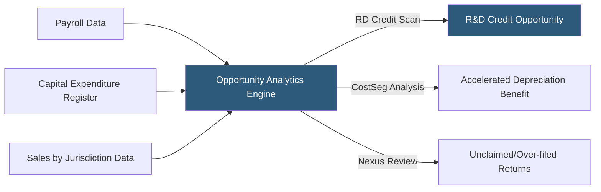

**Category:** Business Intelligence & Tax Analytics
**Difficulty:** Intermediate
**Reading time:** 6 min read

---

Tax opportunity identification uses analytics to systematically surface under-claimed credits, deductions, and structural efficiencies that reduce the organization's tax burden. Data-driven approaches mine transaction-level records, payroll data, and capital expenditure registers to identify opportunities that manual review processes typically miss.

- **R&D tax credit** — Federal and state credit for qualified research expenses that analytics can identify from payroll and project cost data
- **Cost segregation** — Engineering study accelerating depreciation on building components, quantifiable through property transaction analytics
- **Section 179 deduction** — Immediate expensing of qualifying business property identified from fixed asset schedules
- **Nexus analysis** — Analytical determination of which states require tax returns based on sales, property, and payroll thresholds
- **Transfer pricing optimization** — Restructuring intercompany arrangements to align taxable income with jurisdiction tax rates
- **Tax credit carryforward utilization** — Identifying expiring credits that should be prioritized for use
- **Energy tax credits** — IRA clean energy investment credits quantifiable from capital project analytics
- **Employee retention credit (ERC)** — CARES Act credit identifiable through payroll analytics against eligible quarters

Tax opportunity analytics mines source financial data systems to identify under-claimed benefits. For R&D tax credits, the analytics engine classifies payroll records by employee job function codes mapped to qualified research activities, calculates the base period average for the ASC credit calculation method, and estimates the available federal and state credit across all qualifying entities.

Cost segregation analytics examine capital expenditure records for building acquisitions and improvements, applying IRS-accepted allocation percentages for personal property components (5-year, 7-year, 15-year MACRS) versus structural components (39-year). The analysis quantifies the NPV benefit of accelerated depreciation relative to straight-line.

Nexus analysis tools compare the organization's sales, payroll, and property in each state against economic nexus thresholds (typically $100,000 in sales or 200 transactions under post-Wayfair standards). Analytics identify states where the company has nexus but is not filing, or is filing unnecessarily where activity falls below thresholds.

Energy tax credit analytics inventory capital projects against IRA Section 48 investment tax credit and Section 45 production tax credit eligibility criteria, computing the eligible credit basis for solar, wind, battery storage, and other qualified property.

Tax attribute analytics track NOL and credit carryforward balances, their expiration dates, and projected utilization under the base case plan, flagging expiring attributes that require accelerated income recognition or planning to preserve value.

- Quantifying unclaimed R&D credits from software development and manufacturing improvement activities
- Identifying cost segregation opportunity from a recently acquired commercial real estate portfolio
- Discovering states where economic nexus is triggered but returns are not being filed
- Inventorying IRA clean energy credits available from capital investment programs
- Finding expiring NOL carryforwards that need immediate income to offset before they expire

| Advantage | Disadvantage |
|-----------|--------------|
| Systematic analytics identifies opportunities missed by manual review | Opportunity quantification estimates require detailed analysis to convert to claimed amounts |
| R&D credit analytics can process payroll data for thousands of employees quickly | R&D credit analytics require qualified research activity classification review by tax counsel |
| Nexus analysis protects against non-compliance penalties in unidentified states | Economic nexus rules change frequently, requiring regular database updates |
| Energy credit analytics capture IRA benefits before project completion | Cost segregation requires engineering expertise to validate analytics-based allocations |

- [Tax Risk Assessment Tools](tax-risk-assessment-tools.md)
- [R&D Tax Credit Calculation](rd-tax-credit-calculation.md)
- [Tax Attribute Tracking](tax-attribute-tracking.md)

---
*Part of the [Business Intelligence & Tax Analytics](index.md) category · [Back to Master Index](../../index.md)*
