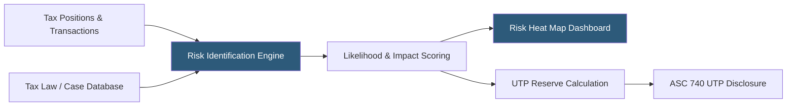

**Category:** Business Intelligence & Tax Analytics
**Difficulty:** Intermediate
**Reading time:** 6 min read

---

Tax risk assessment tools help organizations identify, quantify, and prioritize tax exposures across jurisdictions, transactions, and positions. They combine data analytics with tax law databases to surface positions most likely to be challenged by tax authorities, enabling proactive risk management and reserve adequacy assessment.

- **Tax risk register** — A structured inventory of identified tax risks with likelihood and magnitude scores
- **Uncertain tax position (UTP)** — A tax position where there is doubt about whether the full benefit will be sustained upon examination
- **Reserve adequacy** — Assessment of whether UTP reserves cover the expected exposure with appropriate probability weighting
- **Tax examination risk** — Likelihood that a jurisdiction selects a specific position for audit scrutiny
- **Materiality threshold** — Minimum financial significance level below which risks are not tracked individually
- **Risk heat map** — Visual matrix plotting risks by likelihood and impact to prioritize management attention
- **Transfer pricing risk** — Exposure from intercompany transaction pricing that tax authorities may challenge
- **BEPS risk** — Exposure to OECD base erosion and profit shifting rules including Pillar One and Pillar Two

Tax risk assessment tools systematically evaluate each significant tax position against the probability that the position will not be fully sustained upon examination. Under ASC 740, only positions that meet the "more likely than not" (greater than 50% likelihood) threshold are recognized; positions below this threshold require an uncertain tax position reserve.

The risk scoring process combines quantitative analysis (transaction amounts, historical audit adjustment rates, comparable jurisdiction audit frequencies) with qualitative assessment (strength of authority supporting the position, recent case law, examination history). Tools like Bloomberg Tax's UTP Analytics and BDO's Tax Risk Suite provide databases of audit adjustment precedents to calibrate probability estimates.

Risk heat maps plot each identified risk on a matrix of likelihood (1–5 scale) vs. impact (assessed at risk-weighted exposure amount), enabling tax teams to focus mitigation efforts on high-likelihood, high-impact risks. Quarterly reviews update risk scores as new audit activity, regulations, or transactions change the risk landscape.

Transfer pricing risks receive special attention: arm's-length benchmarking analytics compare intercompany pricing to comparable uncontrolled transaction databases (BvD Bureau van Dijk, Thomson Reuters ONESOURCE TP), computing potential adjustment amounts that drive reserve calculations.

BEPS risk modules assess exposure to global minimum tax (Pillar Two) top-up taxes by entity, computing the top-up amount due in each jurisdiction based on the qualified domestic minimum top-up tax rules and local effective tax rate calculations.

- Preparing the ASC 740 UTP footnote with defensible reserve amounts for each uncertain position
- Prioritizing transfer pricing documentation effort based on quantified risk scores
- Building a risk-based audit response strategy focused on high-exposure positions
- Assessing Pillar Two global minimum tax exposure before the effective date
- Demonstrating to external auditors that tax risk identification and quantification is systematic

| Advantage | Disadvantage |
|-----------|--------------|
| Systematic risk scoring reduces subjectivity in UTP reserve estimation | Risk probability estimates are inherently uncertain and require judgment |
| Heat map prioritization focuses limited tax resources on highest-risk areas | Tax law database subscriptions required for case law and precedent benchmarking |
| Transfer pricing analytics reduce documentation burden for high-risk entities | BEPS Pillar Two calculations require current regulation tracking as rules evolve |
| Documented risk register satisfies auditor expectations for tax control environment | Risk register maintenance requires quarterly updates adding ongoing resource commitment |

- [Tax Scenario Planning](tax-scenario-planning.md)
- [Tax Opportunity Identification](tax-opportunity-identification.md)
- [Tax KPI Tracking](tax-kpi-tracking.md)

---
*Part of the [Business Intelligence & Tax Analytics](index.md) category · [Back to Master Index](../../index.md)*
