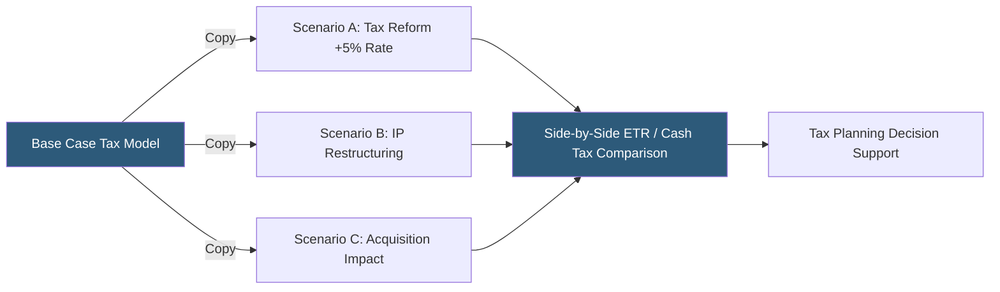

**Category:** Business Intelligence & Tax Analytics
**Difficulty:** Intermediate
**Reading time:** 6 min read

---

Tax scenario planning uses analytics platforms to model the tax impact of alternative strategies, legislative changes, and business decisions simultaneously, enabling tax leadership to quantify risk and opportunity across multiple futures. Effective scenario platforms allow instant comparison of ETR, cash tax, and deferred tax impacts under each scenario without rebuilding models.

- **Base case** — The current-law, current-structure tax model representing expected outcomes
- **Legislative scenario** — A model variant applying proposed or enacted statutory rate changes
- **Structural scenario** — A model testing alternative legal entity structures, holding company locations, or IP ownership
- **Sensitivity analysis** — Quantifying ETR or cash tax change for a unit change in an input (e.g., +1% statutory rate impact)
- **Monte Carlo simulation** — Probabilistic modeling running thousands of scenarios across a distribution of input assumptions
- **Version control** — Tracking scenario model versions to compare current projections against prior assumptions
- **Scenario bridge** — Visualization showing the step-by-step contribution of each assumption difference to the scenario's total ETR variance
- **Consensus scenario** — A single probability-weighted view synthesizing multiple scenario outcomes

Tax scenario planning platforms maintain a base case model representing current-law tax projections for all entities and jurisdictions. Scenarios are created as copies or variants of the base model with specific assumption overrides — a tax reform scenario changes statutory rates in targeted jurisdictions; a restructuring scenario modifies the legal entity structure, inter-entity flows, and applicable treaty rates.

The scenario engine calculates the complete tax provision, ETR, and cash tax impact for each scenario using the same underlying financial data, isolating the effect of the changed assumptions. A scenario bridge visualization shows the specific contribution of each changed assumption: "Rate increase from 21% to 25% adds 1.8% to ETR; new BEAT exposure adds 0.4%; removal of R&D credit cap saves 0.6% — net impact of scenario: +1.6% ETR."

Sensitivity analyses run the model across a range of values for a single variable (statutory rate from 20% to 28%, pre-tax income from -20% to +20% of base case) and plot the ETR or cash tax impact as a line chart, quickly showing break-even points and inflection ranges.

Monte Carlo simulation assigns probability distributions to uncertain inputs (audit settlement amounts, jurisdiction income allocation, incentive credit approval) and runs thousands of model iterations to produce a distribution of likely ETR outcomes with confidence intervals.

Platforms supporting scenario planning include Anaplan, Oracle Hyperion, OneSource Tax Provision, and dedicated tax strategy tools like Bloomberg Tax's scenario modeling module.

- Modeling the ETR impact of proposed OECD Pillar Two global minimum tax rules
- Comparing alternative holding company structures for an international acquisition
- Quantifying the probability distribution of ETR outcomes for earnings guidance setting
- Analyzing the cash tax impact of accelerating or deferring a capital expenditure program
- Running legislative sensitivity analysis for investor relations response preparation

| Advantage | Disadvantage |
|-----------|--------------|
| Parallel scenario comparison replaces sequential manual model rebuilding | Maintaining multiple scenario versions increases model complexity and update burden |
| Sensitivity analysis identifies key input drivers to focus management attention | Monte Carlo requires probability estimates that are inherently uncertain |
| Scenario bridge communication quantifies planning value in ETR terms | Complex scenarios involving restructuring require legal and business input beyond analytics |
| Consensus scenarios provide a single planning number reconciled to the range | Scenario platforms with sophisticated modeling require significant configuration investment |

- [Tax Forecasting Platforms](tax-forecasting-platforms.md)
- [Anaplan Tax Planning](anaplan-tax-planning.md)
- [Tax Risk Assessment Tools](tax-risk-assessment-tools.md)

---
*Part of the [Business Intelligence & Tax Analytics](index.md) category · [Back to Master Index](../../index.md)*
