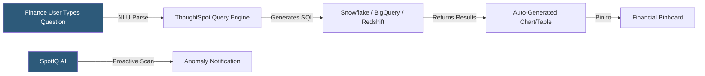

**Category:** Business Intelligence & Tax Analytics
**Difficulty:** Intermediate
**Reading time:** 6 min read

---

ThoughtSpot uses natural language search and AI to allow finance and tax professionals to query financial data by typing questions in plain English, receiving instant answers as visualizations without writing SQL or building dashboard layouts. Its SpotIQ AI automatically surfaces anomalies and insights in financial data, helping teams identify issues proactively.

- **Search bar** — The primary interface where users type financial questions like "revenue by region last quarter vs prior year"
- **Worksheet** — A curated, business-friendly view of financial data configured by data admins to simplify search
- **SpotIQ** — ThoughtSpot's AI engine that proactively analyzes financial data for anomalies, trends, and correlations
- **Pinboard** — A collection of search-generated answers pinned together as a dashboard
- **Natural language query** — Plain English question interpreted by ThoughtSpot's NLU to generate analytical SQL
- **Eureka** — ThoughtSpot's AI assistant for guided conversational analytics
- **Row-level security** — Restriction rules applied to worksheets ensuring users see only authorized financial data
- **ThoughtSpot Everywhere** — Embedding API and React components for integrating search analytics in other applications

ThoughtSpot connects directly to cloud data warehouses (Snowflake, BigQuery, Redshift, Databricks) and runs queries in real time against the warehouse rather than maintaining its own data store. Data engineers configure worksheets — curated views that expose relevant financial tables with business-friendly column names (e.g., "Revenue" instead of "net_amount_usd") and pre-defined formulas.

Finance users interact primarily through the search bar. Typing "operating expenses by department Q3 2025 vs Q3 2024" triggers ThoughtSpot's NLU engine to parse the query, identify the relevant worksheet, select dimensions (department, period) and measures (operating expenses), apply the date filter, and generate the comparison SQL. Results render as a default chart type that users can change.

SpotIQ analyzes financial data automatically to surface insights that analysts might miss. It scans for significant deviations from historical trends, unusual correlations between financial metrics, and segments driving disproportionate performance. SpotIQ results appear as an "Insights" feed and can be subscribed to for automated delivery.

For programmatic financial queries, ThoughtSpot's REST API and TML (ThoughtSpot Modeling Language) allow developers to create, deploy, and manage worksheets and pinboards as code, enabling GitOps-style governance of financial analytics definitions.

- Allowing non-technical finance managers to self-serve answers to ad-hoc P&L questions
- Proactively detecting unusual tax expense movements before close finalization
- Enabling CFO to query financial performance conversationally from a mobile device
- Building a financial "data catalog" where employees can search available financial metrics
- Embedding search-driven financial analytics within an ERP portal

| Advantage | Disadvantage |
|-----------|--------------|
| Natural language interface democratizes financial analytics beyond SQL users | NLU accuracy depends on well-configured worksheets with business-friendly definitions |
| SpotIQ proactive insights catch anomalies without manual monitoring | SpotIQ recommendations require tuning to reduce noise from expected variances |
| Direct warehouse queries eliminate extract synchronization delays | Real-time warehouse queries can be costly at scale with many concurrent users |
| Search interface eliminates dashboard backlog for FP&A teams | Complex multi-step financial calculations still require worksheet pre-configuration |

- [Sisense Embedded Analytics](sisense-embedded-analytics.md)
- [Tableau Financial Analytics](tableau-financial-analytics.md)
- [Tax KPI Tracking](tax-kpi-tracking.md)

---
*Part of the [Business Intelligence & Tax Analytics](index.md) category · [Back to Master Index](../../index.md)*
