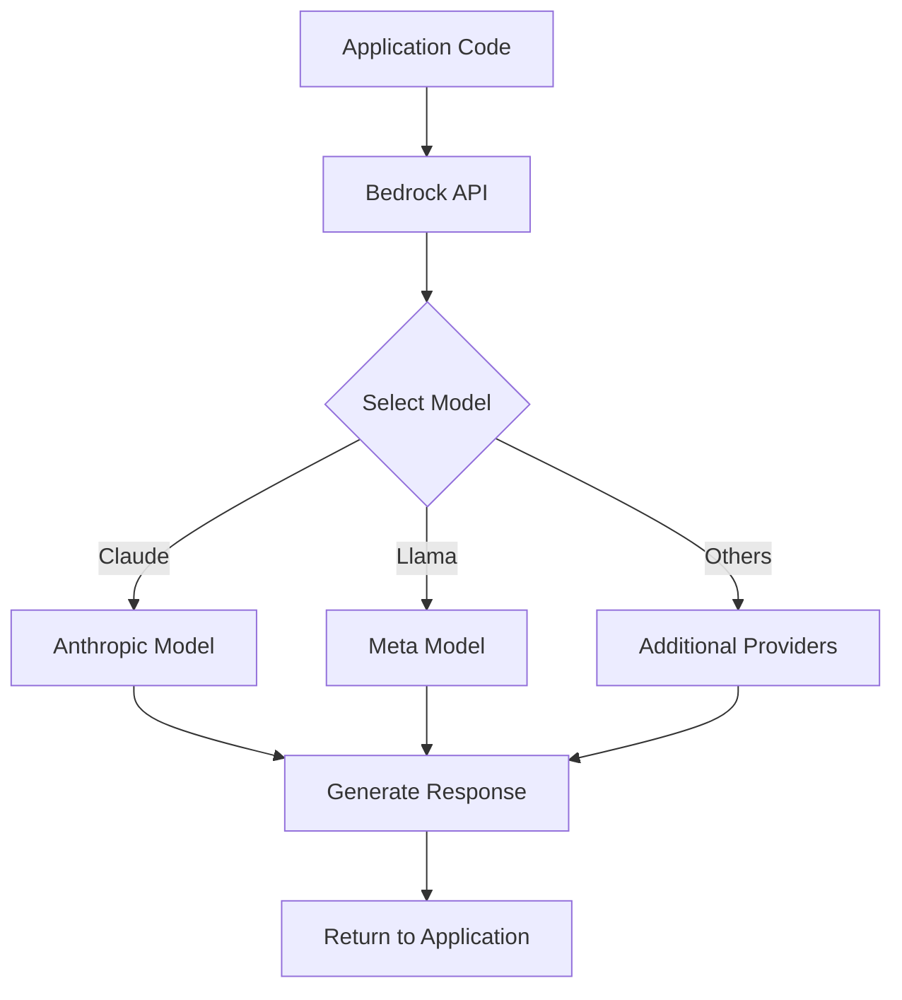

**Category:** Cloud Provider AI Services
**Difficulty:** Intermediate
**Reading time:** 6 min read

---

AWS Bedrock provides access to multiple foundation models (large language models and other generative AI models) through a unified API. This service eliminates the need to manage infrastructure, handles model versioning, and provides built-in features like prompt engineering and model comparison.

- **Foundation Model** — large pre-trained models capable of handling multiple tasks with minimal fine-tuning
- **Model Provider** — third-party companies whose models are offered through Bedrock (Anthropic, Meta, etc.)
- **API Integration** — standard request/response interface for interacting with multiple different models
- **Throughput Provisioning** — reserving model throughput capacity for predictable workloads
- **Prompt Engineering** — crafting effective inputs to guide model behavior and output quality

Bedrock abstracts underlying infrastructure complexity by providing unified API access to multiple models. Applications send prompts and configuration parameters to Bedrock endpoints. The service routes requests to selected models, handles rate limiting, and returns generated text or embeddings. Model responses can be streamed in real-time or returned in full. Bedrock manages model versioning, allowing applications to pin specific versions or use latest updates. Throughput provisioning reserves capacity for predictable baseline traffic at discounted rates. On-demand pricing handles traffic above provisioned capacity. Integration with IAM enables access controls and audit logging.

- Rapid development of generative AI applications without model deployment
- Comparing multiple models for task-specific performance evaluation
- Building chatbots and conversational interfaces
- Content generation for marketing and creative workflows
- Document analysis and summarization
- Code generation and development assistance

| Advantage | Disadvantage |
|-----------|--------------|
| No infrastructure management required | Less control over model internals |
| Access to multiple models through single API | Higher latency than self-hosted models |
| Rapid development and experimentation | Data sent to AWS (privacy consideration) |
| Automatic model updates and versioning | Per-request pricing can be expensive at scale |
| No model fine-tuning infrastructure costs | Limited to provided model selection |

- [Bedrock model customization](bedrock-model-customization.md)
- [Bedrock knowledge bases](bedrock-knowledge-bases.md)
- [Bedrock agents](bedrock-agents.md)

---
*Part of the [Cloud Provider AI Services](../index.md) category · [Back to Master Index](../../index.md)*
