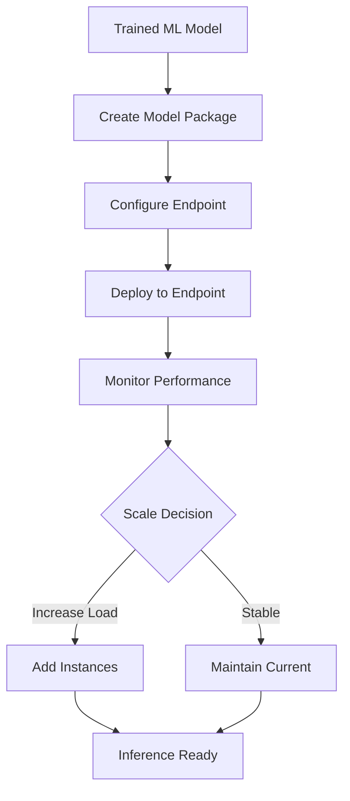

**Category:** Cloud Provider AI Services
**Difficulty:** Intermediate
**Reading time:** 6 min read

---

AWS SageMaker Model Hosting provides managed endpoints for deploying machine learning models in production. It handles infrastructure management, auto-scaling, and model versioning, allowing data scientists and engineers to serve predictions at scale without managing underlying compute resources or operational complexity.

- **Endpoint** — a hosted ML model instance that accepts inference requests and returns predictions
- **Variant** — different versions or configurations of models deployed to the same endpoint for A/B testing
- **Instance Type** — EC2 compute resources (ml.m5.large, ml.p3.2xlarge, etc.) that host model containers
- **Auto-scaling** — automatic adjustment of instance count based on traffic demand and CloudWatch metrics
- **Model Package** — containerized model with inference code, dependencies, and metadata ready for deployment

SageMaker hosting workflows begin with preparing a trained model and creating a container image with inference code. Users define an endpoint configuration specifying instance types, counts, and model variants. SageMaker launches the endpoint, distributing the model across specified instances. When requests arrive, the endpoint routes them to available instances and returns predictions. Auto-scaling policies monitor metrics like CPU utilization and request count, automatically adding or removing instances. CloudWatch provides visibility into endpoint performance, latency, and error rates. Multiple model variants can serve simultaneously for canary deployments or A/B testing. Updates to models trigger new versions while maintaining endpoint availability through rolling updates.

- Deploying trained TensorFlow, PyTorch, or scikit-learn models for real-time predictions
- Running batch predictions on large datasets at scheduled times
- A/B testing model variants to improve prediction accuracy
- Multi-model endpoints serving different models from single endpoint
- Serverless inference for variable workloads
- Real-time personalization and recommendation engines

| Advantage | Disadvantage |
|-----------|--------------|
| Fully managed infrastructure reduces operational burden | Less control over underlying compute resources |
| Auto-scaling handles variable traffic automatically | Per-instance hourly charges accumulate quickly |
| Built-in monitoring and logging integration | Cold starts can add latency for unused endpoints |
| Easy model versioning and A/B testing | Requires containerizing inference code |
| High availability across multiple availability zones | Learning curve for endpoint configuration |

- [SageMaker real-time inference](sagemaker-real-time-inference.md)
- [SageMaker batch transform](sagemaker-batch-transform.md)
- [SageMaker multi-model endpoints](sagemaker-multi-model-endpoints.md)

---
*Part of the [Cloud Provider AI Services](../index.md) category · [Back to Master Index](../../index.md)*
