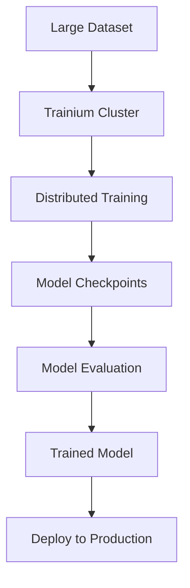

**Category:** Cloud Provider AI Services
**Difficulty:** Intermediate
**Reading time:** 6 min read

---

AWS Trainium is a custom chip designed specifically for deep learning model training. Combined with optimized software, Trainium delivers better training performance and cost efficiency compared to general-purpose GPUs for many machine learning workloads.

- **Trainium Chip** — custom AWS ML accelerator optimized for training workloads
- **Training Performance** — speed improvements enabling faster model iteration and experimentation
- **Cost Per Model** — lower training costs compared to GPU-based training approaches
- **Distributed Training** — multi-node training supported for large models and datasets
- **Framework Integration** — support for PyTorch, TensorFlow, and other popular ML frameworks

Trainium training leverages custom chips providing efficient matrix operations essential for deep learning. Multiple Trainium instances can be clustered for distributed training, scaling to large models. Training frameworks compile models to Trainium format, applying optimizations for hardware capabilities. Data parallelism distributes batches across instances for throughput improvement. Model parallelism splits large models across instances for memory efficiency. Checkpointing saves model state periodically for fault tolerance and resuming after interruptions. Training metrics track progress and facilitate early stopping decisions. Trained models deploy directly to SageMaker or other inference platforms.

- Training large language models cost-effectively
- Rapid model experimentation and iteration
- Fine-tuning foundation models on proprietary data
- Computer vision model development
- Recommendation system training
- NLP model training for specialized domains

| Advantage | Disadvantage |
|-----------|--------------|
| Lower per-training cost than GPUs | Limited to training, not inference |
| Superior training performance on many models | Learning curve for optimization |
| Distributed training simplifies large model handling | Custom hardware less flexible than GPUs |
| Cost-effective for long training jobs | Smaller ecosystem than CUDA-based training |
| Integrated with AWS ML services | Model adaptation required for optimization |

- [AWS Neuron for Inferentia](aws-neuron-for-inferentia.md)
- [AWS SageMaker model hosting](aws-sagemaker-model-hosting.md)
- [SageMaker real-time inference](sagemaker-real-time-inference.md)

---
*Part of the [Cloud Provider AI Services](../index.md) category · [Back to Master Index](../../index.md)*
