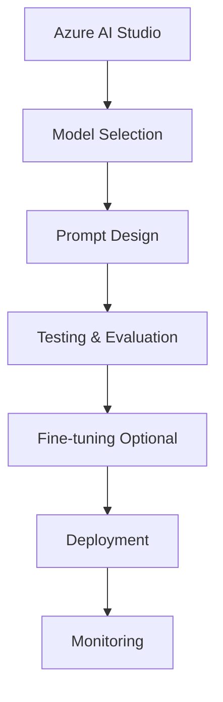

**Category:** Cloud Provider AI Services
**Difficulty:** Intermediate
**Reading time:** 6 min read

---

Azure AI Studio is a unified platform for building, testing, and deploying AI applications. It integrates various Azure AI services and provides tooling for prompt engineering, model evaluation, and deployment workflows.

- **Unified Platform** — single interface for multiple AI services and workflows
- **Prompt Engineering** — tools for designing and testing model prompts
- **Model Catalog** — browsable collection of available models and prebuilt solutions
- **Evaluation Framework** — metrics and testing tools for model quality assessment
- **Deployment Workflows** — streamlined processes from development to production

Azure AI Studio provides web-based interface for AI development. Teams select models from catalog and design prompts for their use cases. Built-in testing tools evaluate model outputs against quality criteria. Evaluation metrics guide optimization. Optional fine-tuning adapts models to specific domains. Deployment workflows integrate with Azure services for production hosting. Monitoring tracks model performance and user interactions. Version control tracks changes across development lifecycle. Collaboration features enable team workflows.

- Rapid prototyping of AI applications
- Model selection and comparison
- Prompt engineering for chatbots
- Fine-tuning models on proprietary data
- Building end-to-end AI workflows
- Team collaboration on AI projects

| Advantage | Disadvantage |
|-----------|--------------|
| Unified platform reduces context switching | Learning curve for new users |
| Integrated evaluation tools improve quality | Limited to Azure models initially |
| Streamlined deployment workflows | Vendor lock-in to Azure |
| Built-in monitoring and analytics | May be overkill for simple projects |
| Team collaboration features | Pricing complexity across services |

- [Azure OpenAI Service](azure-openai-service.md)
- [Azure AI Model Catalog](azure-ai-model-catalog.md)
- [Azure Cognitive Services](azure-cognitive-services.md)

---
*Part of the [Cloud Provider AI Services](../index.md) category · [Back to Master Index](../../index.md)*
