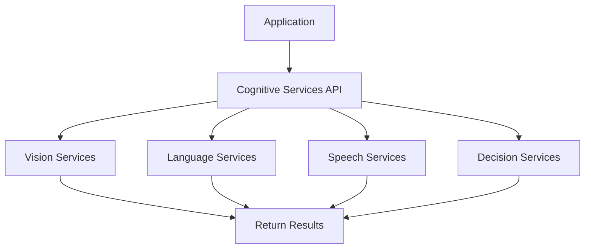

**Category:** Cloud Provider AI Services
**Difficulty:** Intermediate
**Reading time:** 6 min read

---

Azure Cognitive Services provide pre-built APIs for vision, language, speech, and decision-making tasks. These managed services eliminate need to train models from scratch for common AI tasks, enabling rapid integration into applications.

- **Pre-built APIs** — ready-to-use services for common AI tasks without model training
- **Multi-modal** — support for vision, speech, language, and combined modalities
- **REST/SDK Integration** — standard interfaces for application integration
- **Scalability** — managed services handling variable traffic automatically
- **Compliance** — enterprise features and data privacy controls

Cognitive Services provide modular APIs each focusing on specific tasks. Vision services analyze images for objects, text, faces, and sentiment. Language services extract entities, classify text, and identify language. Speech services convert speech-to-text and text-to-speech. Decision services provide anomaly detection and content moderation. Applications authenticate using API keys and call service endpoints with input data. Services return structured results ready for application processing. Managed infrastructure handles scaling and reliability automatically.

- Image analysis and object detection in applications
- Sentiment analysis of customer feedback
- Speech-to-text transcription services
- Language translation
- Face detection and recognition
- Document intelligence and text extraction

| Advantage | Disadvantage |
|-----------|--------------|
| No ML expertise required for common tasks | Less customization than custom models |
| Rapid development with pre-built services | Per-API costs can accumulate |
| Pre-trained on large datasets | Vendor lock-in to Azure |
| Managed scaling handles variable traffic | Privacy considerations for cloud processing |
| Integrated with other Azure services | Limited to predefined task types |

- [Azure Custom Vision](azure-custom-vision.md)
- [Azure AI Studio](azure-ai-studio.md)
- [Azure OpenAI Service](azure-openai-service.md)

---
*Part of the [Cloud Provider AI Services](../index.md) category · [Back to Master Index](../../index.md)*
