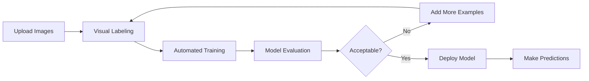

**Category:** Cloud Provider AI Services
**Difficulty:** Intermediate
**Reading time:** 6 min read

---

Azure Custom Vision enables building specialized image classification and object detection models without deep learning expertise. The service simplifies the model training process through visual labeling interfaces and automated optimization.

- **Visual Labeling** — marking regions in images for model training
- **Automated Training** — service optimizes models without hyperparameter tuning
- **Transfer Learning** — leveraging pre-trained models for faster convergence
- **Quick Iteration** — rapid testing and improvement cycles
- **Export Capabilities** — deploying models to edge devices or cloud endpoints

Custom Vision starts with uploading domain-specific images and visually marking objects or regions through web interface. The service handles image preprocessing and augmentation. Automated training applies transfer learning, starting from pre-trained models and fine-tuning on provided data. Training typically requires 10-50+ labeled examples per class. Evaluation metrics guide determination of sufficient training data. Models can export to various formats for edge deployment or cloud endpoints. Real-time predictions on new images use the trained model.

- Custom object detection for manufacturing quality control
- Domain-specific image classification
- Plant disease detection for agriculture
- Building inspection and damage assessment
- Custom logo detection
- Specialized medical image analysis

| Advantage | Disadvantage |
|-----------|--------------|
| No deep learning expertise required | Limited to vision tasks only |
| Rapid training with small datasets | Export options sometimes limited |
| Visual labeling interface simplicity | Per-image pricing for predictions |
| Automated model optimization | Privacy: data sent to cloud for training |
| Export to edge devices possible | Learning curve for optimization |

- [Azure Cognitive Services](azure-cognitive-services.md)
- [Azure AI Studio](azure-ai-studio.md)
- [Azure Machine Learning endpoints](azure-machine-learning-endpoints.md)

---
*Part of the [Cloud Provider AI Services](../index.md) category · [Back to Master Index](../../index.md)*
