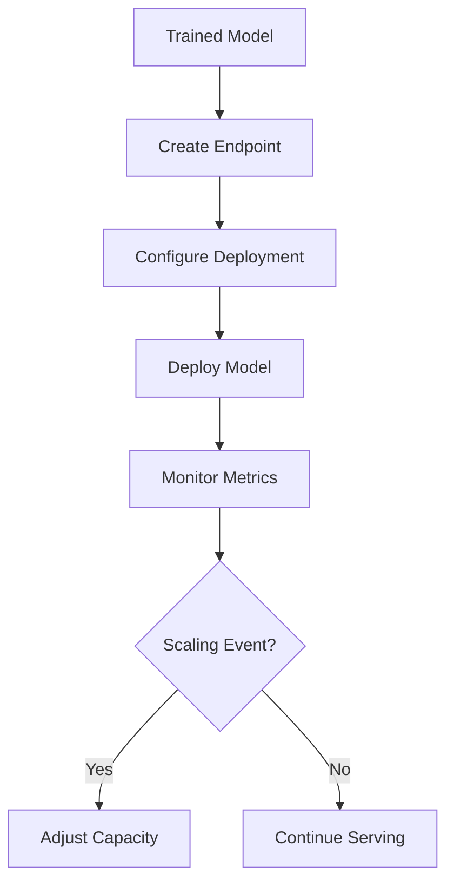

**Category:** Cloud Provider AI Services
**Difficulty:** Intermediate
**Reading time:** 6 min read

---

Azure Machine Learning Endpoints provide managed model hosting for both real-time and batch inference scenarios. Azure handles infrastructure provisioning, scaling, and monitoring, enabling ML teams to serve models without managing underlying compute resources.

- **Managed Endpoint** — fully managed hosting for ML models with automatic infrastructure management
- **Deployment** — specific model version and configuration served by an endpoint
- **Scaling Configuration** — instance count and auto-scaling policies for traffic handling
- **Model Versioning** — tracking multiple model versions under single endpoint
- **Integration** — connection to Azure ML training pipelines and datasets

Azure ML endpoints abstract underlying compute infrastructure, handling provisioning and management. Teams define deployment configurations specifying model, instance type, and scaling policies. Azure automatically provisions instances, loads models, and handles request routing. Endpoints provide inference REST APIs for integration with applications. Auto-scaling monitors CPU, memory, and request metrics, adjusting capacity automatically. Multiple deployments to single endpoint enable A/B testing and gradual rollouts. CloudWatch-like monitoring provides visibility into endpoint performance. Model updates can be deployed without endpoint recreation through rolling updates.

- Hosting trained scikit-learn, PyTorch, and TensorFlow models
- Real-time model serving for web applications
- Batch scoring large datasets
- A/B testing model variants
- Multi-model endpoints for ensemble predictions
- Continuous deployment of model improvements

| Advantage | Disadvantage |
|-----------|--------------|
| Fully managed reduces operational burden | Less control over infrastructure details |
| Auto-scaling handles variable traffic | Hourly billing accumulates quickly |
| Easy integration with Azure ML ecosystem | Learning curve for endpoint configuration |
| Built-in monitoring and logging | Cold starts with serverless options |
| Supports multiple deployment patterns | Vendor lock-in to Azure platform |

- [Azure ML online endpoints](azure-ml-online-endpoints.md)
- [Azure ML batch endpoints](azure-ml-batch-endpoints.md)
- [Azure OpenAI Service](azure-openai-service.md)

---
*Part of the [Cloud Provider AI Services](../index.md) category · [Back to Master Index](../../index.md)*
