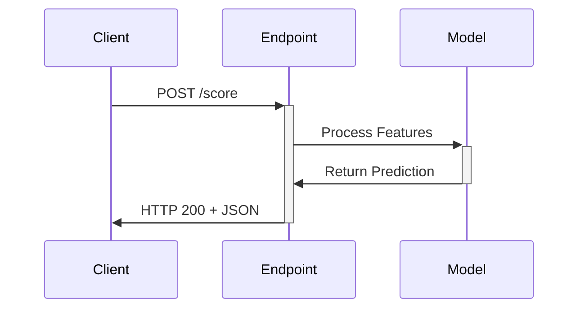

**Category:** Cloud Provider AI Services
**Difficulty:** Intermediate
**Reading time:** 6 min read

---

Azure ML Online Endpoints deliver real-time inference through low-latency REST APIs. These synchronous endpoints suit applications requiring immediate predictions, such as real-time recommendations and interactive services.

- **REST API** — HTTP endpoint accepting JSON requests and returning predictions
- **Latency** — response time critical for user-facing applications
- **Throughput** — number of concurrent requests handled per unit time
- **Traffic Management** — routing requests to healthy instances and handling failures
- **Integration Pattern** — synchronous call-and-response for immediate results

Online endpoints expose REST APIs accepting prediction requests. Clients format data according to model requirements and POST requests to the endpoint URL. Azure routes requests to healthy instances, balancing load across replicas. Each instance runs the model container, processes features, and returns predictions. Responses include predicted values and confidence scores. Latency depends on network distance, request size, and model complexity. Azure provides SDKs for common programming languages simplifying integration. Monitoring tracks latency, throughput, and error rates. Auto-scaling adjusts instance count based on demand.

- Real-time recommendation engines for e-commerce
- Fraud detection for payment processing
- Interactive chatbots and virtual assistants
- Image classification APIs
- Sentiment analysis for customer feedback
- Dynamic pricing based on market conditions

| Advantage | Disadvantage |
|-----------|--------------|
| Immediate responses enable interactive applications | Continuous instances incur ongoing costs |
| Easy API integration with applications | Latency overhead from network and containers |
| High throughput for persistent endpoints | Limited batching opportunities |
| Built-in load balancing and failover | Cold starts not acceptable for critical systems |
| Integration with Azure ecosystem | Requires careful instance type selection |

- [Azure Machine Learning endpoints](azure-machine-learning-endpoints.md)
- [Azure ML batch endpoints](azure-ml-batch-endpoints.md)
- [Azure OpenAI Service](azure-openai-service.md)

---
*Part of the [Cloud Provider AI Services](../index.md) category · [Back to Master Index](../../index.md)*
