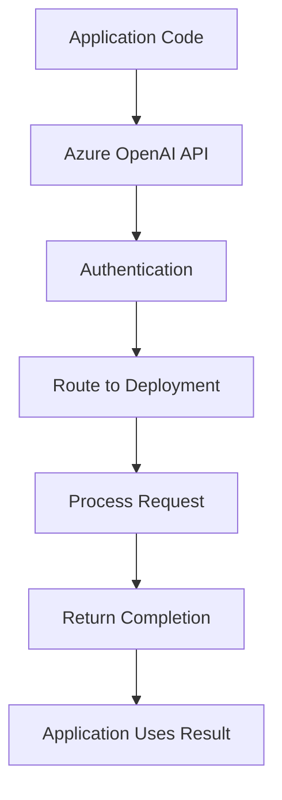

**Category:** Cloud Provider AI Services
**Difficulty:** Intermediate
**Reading time:** 6 min read

---

Azure OpenAI Service provides managed access to OpenAI's GPT models through Azure infrastructure. This offering combines OpenAI's advanced models with Azure's enterprise features like VNet integration, compliance, and Azure AD authentication.

- **Model Deployment** — assigning GPT models to Azure resources for application use
- **Tokens** — units of text processed by models, charged per-token basis
- **Quota Management** — controlling rate limits and request volumes
- **Enterprise Integration** — VNet, Private Link, and managed identity support
- **Compliance** — SOC 2, HIPAA, and regional data residency options

Azure OpenAI requires creating deployments assigning specific model versions (GPT-4, GPT-3.5, etc.) to Azure resources. Applications authenticate using Azure AD or API keys and call the deployment endpoint. The service routes requests to Azure-hosted model instances. Models process prompts and generate completions. Azure handles scaling, monitoring, and reliability. Enterprise networking features enable VNet integration for private connectivity. Region selection controls data residency for compliance. Quota management prevents unexpected costs through rate limiting.

- Enterprise AI applications requiring compliance features
- Chatbot development with HIPAA or regulatory requirements
- Integration with existing Azure infrastructure
- Custom model deployment with private networking
- Applications requiring specific data residency
- Multi-region deployments for global audiences

| Advantage | Disadvantage |
|-----------|--------------|
| Enterprise features (VNet, Private Link) | Pricing typically higher than direct OpenAI |
| Compliance features (HIPAA, SOC 2) | Limited model selection compared to OpenAI |
| Azure AD integration for access control | Requires Azure subscription |
| Regional data residency options | Learning curve for Azure ecosystem |
| Integrated with Azure ML ecosystem | Setup complexity for VNet integration |

- [Azure AI Studio](azure-ai-studio.md)
- [Azure AI Model Catalog](azure-ai-model-catalog.md)
- [Azure Cognitive Services](azure-cognitive-services.md)

---
*Part of the [Cloud Provider AI Services](../index.md) category · [Back to Master Index](../../index.md)*
