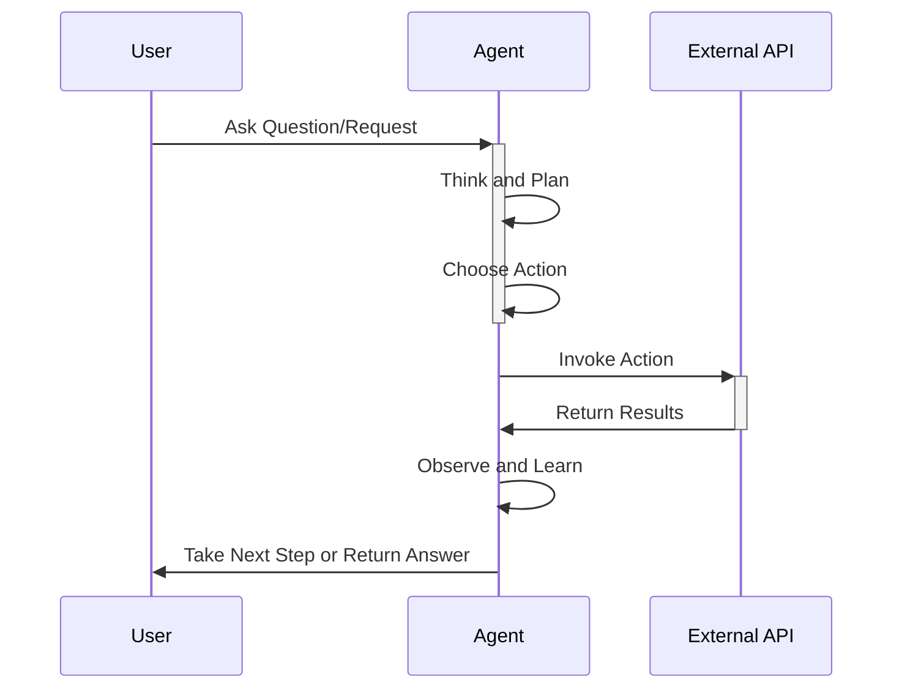

**Category:** Cloud Provider AI Services
**Difficulty:** Intermediate
**Reading time:** 6 min read

---

Bedrock Agents enable foundation models to interact with external systems and APIs to take actions. These autonomous systems can plan tasks, execute API calls, and iterate toward goals, creating interactive applications that go beyond static text generation.

- **Agent Loop** — cycle of thinking, planning, taking action, observing results, and refining
- **Tool Integration** — connecting agents to APIs, databases, and external services
- **Action Groups** — collections of related API endpoints agents can invoke
- **Reasoning** — model's ability to plan sequences of actions toward goals
- **Memory** — maintaining context across multiple interactions within a session

Agents begin with user requests, analyzing requirements to determine necessary actions. The agent examines available tools (API integrations) and plans sequences of calls to fulfill requests. Each action invokes external systems, and the agent observes results to validate progress. If goals aren't met, agents refine strategies and try alternative approaches. This iterative loop continues until requests complete or agents determine tasks impossible. Agents maintain context across iterations, remembering prior steps and constraints. Bedrock handles the orchestration, scaling, and reliability of agent operations. Different agent types support different levels of autonomy and complexity.

- Chatbots that can book appointments, check schedules, and provide information
- Data retrieval assistants accessing databases and knowledge systems
- Automation workflows triggering actions across multiple systems
- Customer service systems with ability to resolve issues programmatically
- Financial agents querying systems and performing authorized transactions
- Research assistants gathering information from multiple sources

| Advantage | Disadvantage |
|-----------|--------------|
| Autonomous task execution reduces manual work | Complex orchestration and debugging |
| Natural language interface for complex operations | Requires careful API integration design |
| Flexible problem-solving approaches | Unpredictable behavior in novel situations |
| Integrates with existing business systems | Security implications of autonomous actions |
| Scales to complex multi-step workflows | Cost of multiple API calls and model invocations |

- [AWS Bedrock foundation models](aws-bedrock-foundation-models.md)
- [Bedrock knowledge bases](bedrock-knowledge-bases.md)
- [Bedrock model customization](bedrock-model-customization.md)

---
*Part of the [Cloud Provider AI Services](../index.md) category · [Back to Master Index](../../index.md)*
