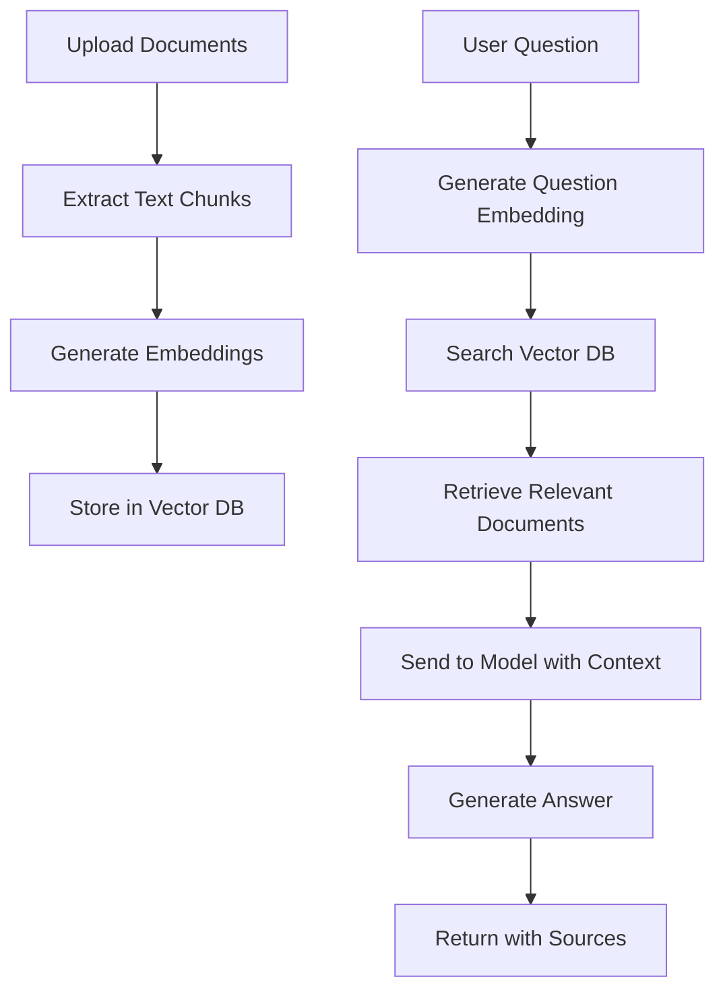

**Category:** Cloud Provider AI Services
**Difficulty:** Intermediate
**Reading time:** 6 min read

---

Bedrock Knowledge Bases enable building retrieval-augmented generation (RAG) systems that combine foundation models with proprietary knowledge. Models can reference specific documents and information, reducing hallucinations and providing accurate, sourced responses grounded in provided content.

- **Retrieval-Augmented Generation (RAG)** — technique combining document retrieval with model generation for accurate responses
- **Vector Embeddings** — numerical representations of text enabling semantic search across documents
- **Vector Database** — storage system for embeddings enabling fast similarity searches
- **Document Ingestion** — process of converting documents into embeddings and storing them
- **Sourcing** — ability to track and cite which documents informed model responses

Knowledge Base setup begins by uploading documents (PDFs, web pages, text files). Bedrock automatically chunks documents into manageable segments and generates vector embeddings using embedding models. Embeddings are stored in managed vector databases. When users ask questions, Bedrock generates embeddings for the question, searches the vector database for semantically similar content, and retrieves relevant document chunks. These chunks augment the prompt sent to foundation models, providing context. Models generate answers grounded in provided documents, reducing fabrication. Responses can include citations to source documents. Continuous updates to knowledge bases enable current information access without model retraining.

- Customer support systems referencing proprietary knowledge bases
- Internal documentation assistance for employees
- Compliance and regulatory document analysis
- Technical support systems using service documentation
- Legal document analysis and contract review
- Medical research systems referencing clinical literature

| Advantage | Disadvantage |
|-----------|--------------|
| Reduces model hallucinations through grounding | Requires document curation and maintenance |
| Easy updates without model retraining | Vector database complexity and costs |
| Sourced responses enable fact-checking | Latency from retrieval and embedding steps |
| Protects proprietary information in embeddings | Quality depends on document organization |
| Enables specialized domain applications | Storage costs for large document collections |

- [AWS Bedrock foundation models](aws-bedrock-foundation-models.md)
- [Bedrock model customization](bedrock-model-customization.md)
- [Bedrock agents](bedrock-agents.md)

---
*Part of the [Cloud Provider AI Services](../index.md) category · [Back to Master Index](../../index.md)*
