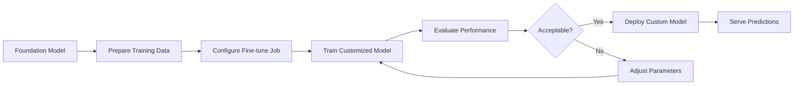

**Category:** Cloud Provider AI Services
**Difficulty:** Intermediate
**Reading time:** 6 min read

---

Bedrock Model Customization enables fine-tuning foundation models on proprietary data to create specialized versions optimized for specific tasks or domains. This capability bridges the gap between general-purpose models and domain-specific requirements while retaining AWS's managed infrastructure benefits.

- **Fine-tuning** — training process adapting pre-trained models to specific tasks using smaller labeled datasets
- **Training Data** — proprietary datasets used to customize models for domain-specific performance
- **Model Versioning** — tracking different fine-tuned model versions for comparison and rollback
- **Instruction Following** — training models to follow specific formats, styles, or task-specific behaviors
- **Evaluation Metrics** — performance measurements guiding fine-tuning success and production readiness

Fine-tuning begins by preparing labeled training data in required format. Users create fine-tuning jobs specifying data location, hyperparameters, and desired model behavior. Bedrock manages the training process, optimizing the foundation model weights on proprietary data. Training typically requires thousands of examples but less data than training from scratch. Evaluation metrics compare custom model performance against baseline foundation model. Successfully trained models receive unique identifiers and can be deployed to endpoints. Multiple custom models can coexist, enabling experimentation and gradual rollout. Bedrock handles versioning and allows pinning to specific model versions.

- Creating domain-specific models for specialized industries (healthcare, finance, legal)
- Fine-tuning for company-specific writing style and terminology
- Improving performance on specialized tasks with limited training data
- Creating models for sensitive applications requiring proprietary data training
- Building competitive advantage through domain knowledge embedding
- Reducing inference costs through improved efficiency on specific tasks

| Advantage | Disadvantage |
|-----------|--------------|
| Leverages foundation model capabilities with custom data | Requires labeled training data |
| Faster than training models from scratch | Training jobs incur additional costs |
| Maintain AWS managed infrastructure benefits | Hyperparameter tuning complexity |
| Improved task-specific performance | Longer time-to-deployment than base models |
| Data remains in AWS environments | Evaluation and validation overhead |

- [AWS Bedrock foundation models](aws-bedrock-foundation-models.md)
- [Bedrock knowledge bases](bedrock-knowledge-bases.md)
- [Bedrock agents](bedrock-agents.md)

---
*Part of the [Cloud Provider AI Services](../index.md) category · [Back to Master Index](../../index.md)*
