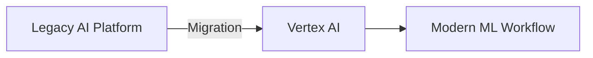

**Category:** Cloud Provider AI Services
**Difficulty:** Intermediate
**Reading time:** 6 min read

---

Google AI Platform (legacy) was Google Cloud's original ML platform, now superseded by Vertex AI. The service provided managed infrastructure for training and deployment but has been deprecated in favor of the more unified Vertex AI offering.

- **Legacy System** — original ML platform architecture predating Vertex AI
- **Migration Path** — tools and guidance for moving to Vertex AI
- **Supported Frameworks** — TensorFlow, scikit-learn, XGBoost support
- **Model Hosting** — deployment infrastructure for inference
- **Batch Prediction** — asynchronous scoring capabilities

AI Platform provided training jobs, model hosting, and batch prediction services. While functional, the platform has been consolidated into Vertex AI, which provides a more unified experience. Users of AI Platform are encouraged to migrate to Vertex AI for access to new features and improvements. Migration tooling helps transition projects with minimal code changes.

- Maintaining existing legacy deployments
- Understanding historical ML platform architectures
- Learning about ML platform evolution
- Migration projects from AI Platform to Vertex AI
- Legacy model serving and support
- Refactoring existing ML workflows

| Advantage | Disadvantage |
|-----------|--------------|
| Stable for existing deployments | No longer actively developed |
| Established workflows preserved | Missing modern features |
| Proven for production use | Recommended to migrate to Vertex AI |
| Documentation available | Limited support going forward |
| Works with existing models | Separate from current ecosystem |

- [Google Vertex AI predictions](google-vertex-ai-predictions.md)
- [Vertex AI custom training](vertex-ai-custom-training.md)
- [Google Cloud TPU hosting](google-cloud-tpu-hosting.md)

---
*Part of the [Cloud Provider AI Services](../index.md) category · [Back to Master Index](../../index.md)*
