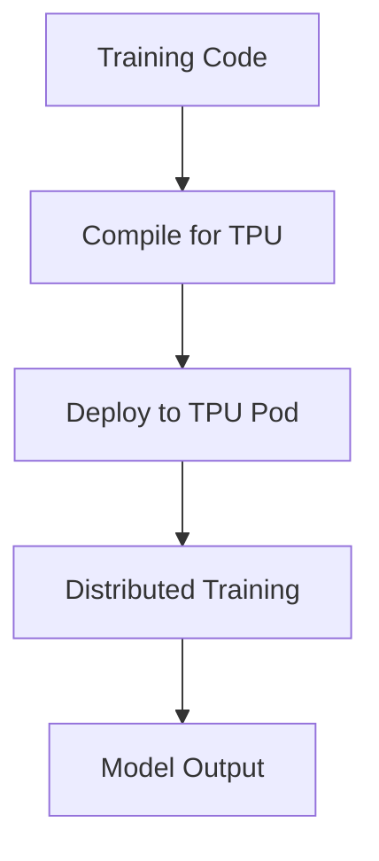

**Category:** Cloud Provider AI Services
**Difficulty:** Intermediate
**Reading time:** 6 min read

---

Google Cloud TPU (Tensor Processing Unit) hosting provides access to specialized AI accelerators for training and inference. TPUs deliver superior performance for large-scale ML workloads, particularly for matrix operations inherent in deep learning.

- **Tensor Processing Unit** — custom AI accelerator optimized for tensor operations
- **Performance** — significantly faster training than GPUs for specific workloads
- **Cost Efficiency** — lower cost per computation for large-scale ML
- **Pod Architecture** — multiple TPUs networked together for distributed training
- **Framework Integration** — TensorFlow and PyTorch support

TPU hosting provisions specialized hardware optimized for ML workloads. Code is compiled to TPU format, optimizing for hardware capabilities. Multiple TPUs can be networked together (TPU pod) for distributed training of very large models. Performance advantages are most pronounced for transformer models and large-scale training. TPUs integrate with Vertex AI for seamless deployment workflows.

- Training large language models
- Large-scale computer vision model training
- Recommendation system training
- NLP model development
- Scientific computing simulations
- High-throughput inference serving

| Advantage | Disadvantage |
|-----------|--------------|
| Superior performance for large-scale ML | Limited flexibility compared to GPUs |
| Cost-efficient for massive workloads | Requires significant compute investment |
| Integrated with Vertex AI | Learning curve for optimization |
| Excellent for transformer models | Less suitable for custom operations |
| Scalable to extreme sizes | Resource reservation required |

- [Google Vertex AI custom training](vertex-ai-custom-training.md)
- [Google Vertex AI predictions](google-vertex-ai-predictions.md)
- [AWS Neuron for Inferentia](aws-neuron-for-inferentia.md)

---
*Part of the [Cloud Provider AI Services](../index.md) category · [Back to Master Index](../../index.md)*
