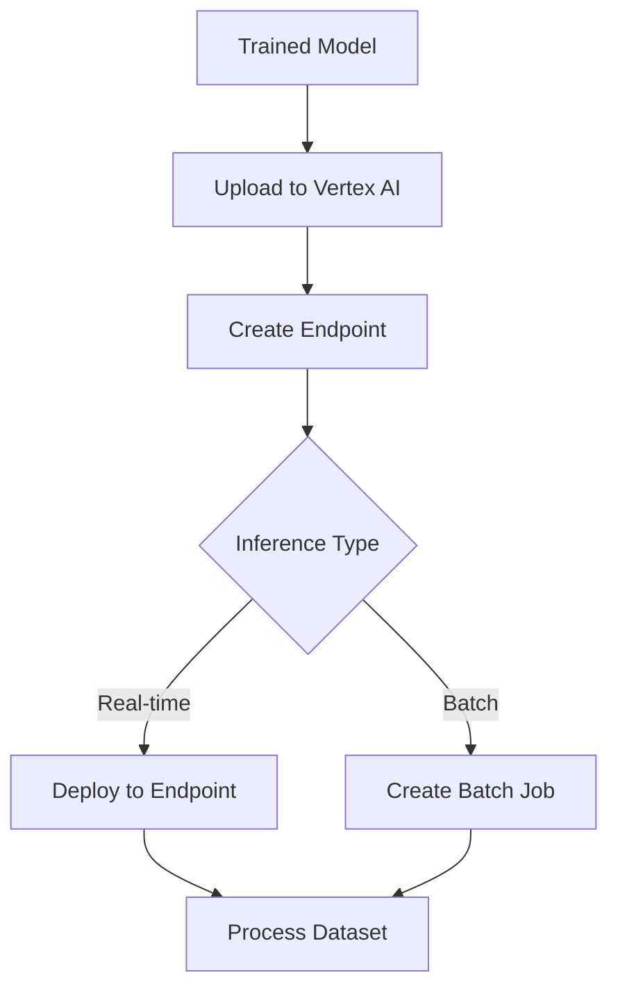

**Category:** Cloud Provider AI Services
**Difficulty:** Intermediate
**Reading time:** 6 min read

---

Google Vertex AI provides unified platform for model training and inference. The prediction service handles both real-time and batch inference with automatic scaling, model versioning, and integrated monitoring for production ML workflows.

- **Endpoints** — hosted model serving inference requests in real-time
- **Batch Prediction** — asynchronous scoring of large datasets
- **Model Registry** — centralized tracking of model versions and metadata
- **Auto-scaling** — automatic instance adjustment based on traffic
- **Monitoring** — integrated metrics for model performance tracking

Vertex AI predictions begin by uploading trained models to the model registry. Teams create endpoints specifying the model, instance type, and scaling configuration. For real-time predictions, endpoints expose REST APIs for application integration. Auto-scaling monitors traffic and adjusts instance counts automatically. Batch predictions process entire datasets stored in Cloud Storage. Feature stores integrate with predictions for consistent feature engineering. Model monitoring tracks performance and detects drift. CloudWatch-like integration provides visibility into prediction quality.

- Real-time prediction serving for web applications
- Batch scoring customer databases
- Model comparison and A/B testing
- Multi-model ensemble predictions
- Federated learning inference
- AutoML model deployment

| Advantage | Disadvantage |
|-----------|--------------|
| Unified platform reduces complexity | Vendor lock-in to Google Cloud |
| Strong AutoML integration | Limited to GCP ecosystem |
| Advanced feature store integration | Competitive pricing with AWS |
| Comprehensive monitoring | Requires GCP account setup |
| Global deployment simplified | Learning curve for new users |

- [Vertex AI online prediction](vertex-ai-online-prediction.md)
- [Vertex AI batch prediction](vertex-ai-batch-prediction.md)
- [Vertex AI Model Garden](vertex-ai-model-garden.md)

---
*Part of the [Cloud Provider AI Services](../index.md) category · [Back to Master Index](../../index.md)*
